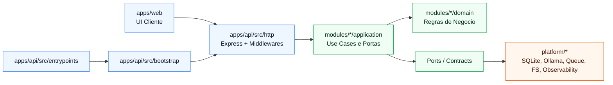
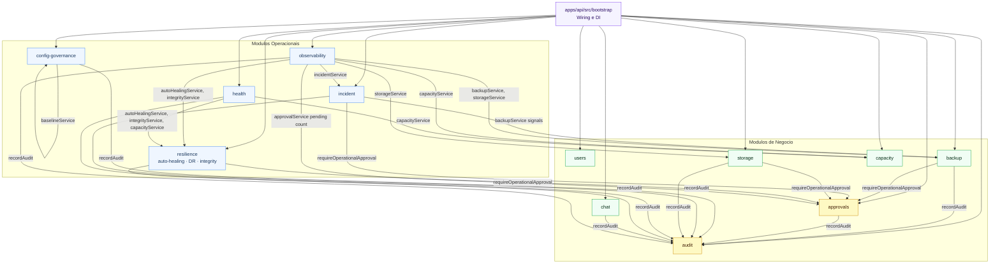
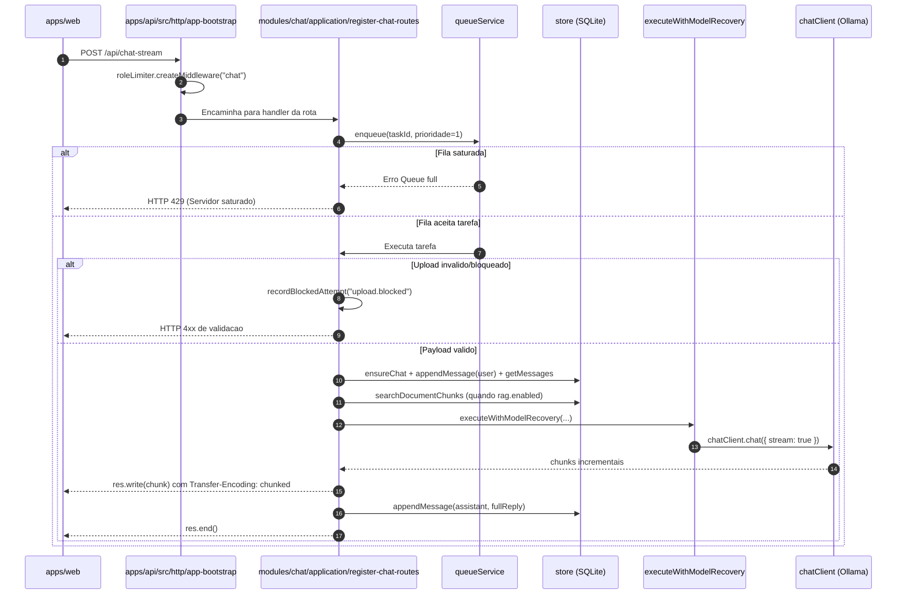
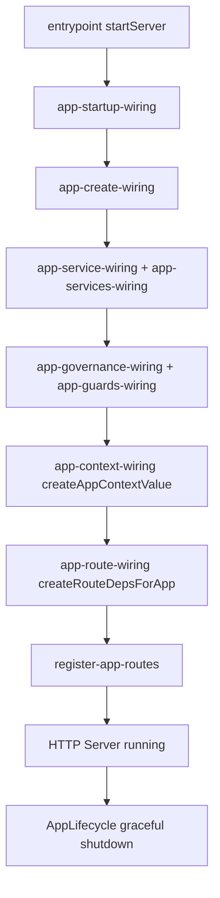
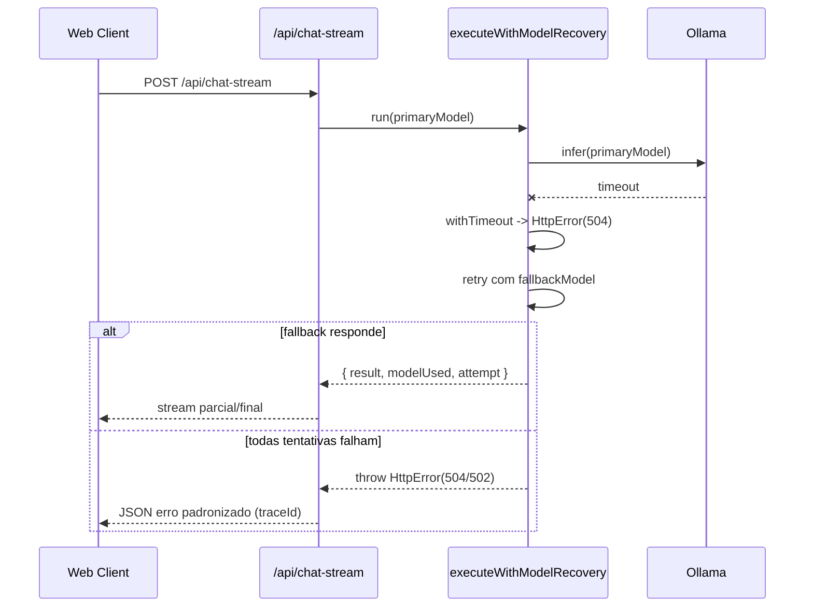
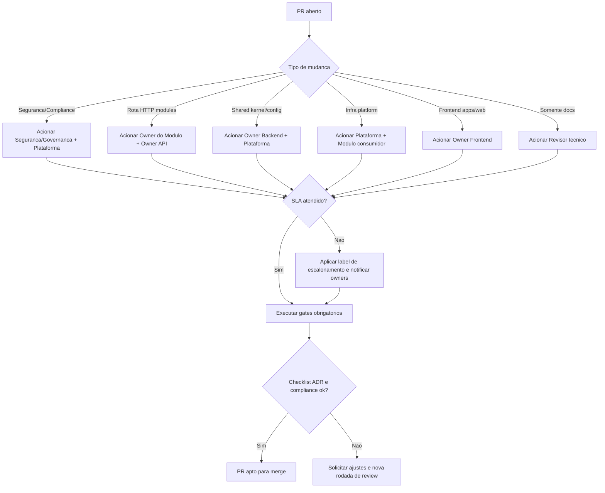

# Chat Local com Ollama + Streaming


Projeto de chat local com Web moderna, streaming em tempo real, persistencia de conversas em SQLite e controle avancado de inferencia (modelo, temperatura e contexto).

## Visao geral

### Contexto global para assistentes (Gemini)

Para melhorar respostas de ferramentas como Google AI Studio (Gemini), este repositorio inclui um contexto global em `CONTEXT.md`.

Esse arquivo resume rapidamente a topologia das aplicacoes:

- `apps/api`: core backend Node.js/Express (porta 4000)
- `apps/web`: frontend do usuario servido pela API
- `apps/web-admin`: painel operacional servido na rota `/admin`

Recomendacao: sempre carregar `CONTEXT.md` antes de pedir analise arquitetural ou navegacao entre modulos.

### Skills de agentes (catalogo rapido)

Este projeto mantem skills em `.agents/skills/` para padronizar como assistentes tecnicos analisam e modificam o repositorio.

- `arquitetura`: mapeamento estrutural e diretrizes arquiteturais do projeto.
- `code-reviewer`: revisao tecnica de qualidade, risco e seguranca.
- `local-first`: praticas para operacao local sem dependencia de cloud.
- `portuguese_assistant`: padrao de respostas em pt-BR com termos tecnicos.
- `skill-creator`: meta-skill para criacao de novas skills.
- `gemini-context-profissional`: skill oficial para onboarding arquitetural com base em `CONTEXT.md`, especialmente para Google AI Studio (Gemini).

Para cenarios de Gemini, priorize a skill `gemini-context-profissional` e valide se `CONTEXT.md` esta atualizado.

- Aplicacao local completa com API Node.js/Express nativa (ESM), Web e persistencia SQLite
- Servidor baseado em ESM nativo (Node.js), com grafo de dependencias estatico via `import`/`export`, fronteiras claras entre entrypoint/bootstrap/http/modulos e menor acoplamento entre camadas arquiteturais
- Integracao com Ollama para chat sincrono e streaming token a token
- Experiencia multimodal com voz, imagens, RAG local por aba e exportacao de conversas
- Operacao assistida com checagens de saude, SLO, auto-healing, scorecard, diagnostico e auditoria local
- Automacoes operacionais para canary, DR test, perfil de capacidade, backup e distribuicao
- Suite de testes de API/Web e pipeline CI para validar regressao, seguranca e qualidade
- Frontend atual em JavaScript Vanilla (`apps/web`) com roadmap de migracao para React + Vite

Pontos de entrada para usuario final:

- `/`: aplicacao de chat principal
- `/produto`: pagina de produto com proposta de valor e recursos
- `/guia`: guia rapido com configuracao, primeiros passos e resolucao de problemas enxuta
- `apps/web-admin`: painel de administracao do servidor via SPA, monitorando Kernel, Heap e Saude da aplicacao

## Arquitetura

### Indice de ADRs inline documentados

Navegacao rapida para os blocos de decisao arquitetural registrados neste README.  
Para uma visao consolidada com resumos, mapa de gaps e hubs de acoplamento, consulte [`docs/architecture/adr-index.md`](docs/architecture/adr-index.md).

| Modulo | Rotas cobertas | Decisoes | Checklist especifica | Owner sugerido | Link |
|--------|---------------|----------|----------------------|----------------|------|
| **Chat streaming** | `POST /api/chat-stream` | 5 | 3 itens | Backend (chat) | [↓ chat-stream ADR](#mini-adr-inline--decisoes-de-arquitetura-do-chat-stream) |
| **Chat sincrono** | `POST /api/chat` | 3 | — (coberto pela global) | Backend (chat) | [↓ chat-sync ADR](#mini-adr-inline--decisoes-de-arquitetura-do-chat-sincrono-post-apichat) |
| **Backup** | `GET /api/backup/export` · `POST /api/backup/restore` · `GET /api/backup/validate` | 5 | 5 itens | Backend (backup) | [↓ backup ADR](#mini-adr-inline--decisoes-de-arquitetura-do-modulo-backup) |
| **Approvals** | `GET /api/approvals` · `POST /api/approvals` · `POST /api/approvals/:id/decision` | 5 | 5 itens | Backend (governance) | [↓ approvals ADR](#mini-adr-inline--decisoes-de-arquitetura-do-modulo-approvals) |
| **Config Governance** | `GET /api/config/versions` · `POST /api/config/versions/:id/rollback` · `GET /api/config/baseline` · `POST /api/config/baseline` | 5 | 4 itens | Backend (governance) | [↓ config ADR](#mini-adr-inline--decisoes-de-arquitetura-do-modulo-config-governance) |
| **Incident** | `GET /api/incident/status` · `PATCH /api/incident/status` · `POST /api/incident/runbook/execute` | 5 | 4 itens | Backend (incident) | [↓ incident ADR](#mini-adr-inline--decisoes-de-arquitetura-do-modulo-incident) |
| **Resilience** | `GET /api/auto-healing/status` · `PATCH /api/auto-healing/status` · `POST /api/auto-healing/execute` · `POST /api/disaster-recovery/test` · `GET /api/integrity/status` · `POST /api/integrity/verify` | 5 | 4 itens | Backend (resilience) | [↓ resilience ADR](#mini-adr-inline--decisoes-de-arquitetura-do-modulo-resilience) |
| **Health / Observability** | `/readyz` · `/api/health` · `/api/slo` · `/api/telemetry` · `PATCH /api/telemetry` · `/api/diagnostics/export` · `POST /api/observability/gc` | 5 | 4 itens | Backend (observability) | [↓ health ADR](#mini-adr-inline--decisoes-de-arquitetura-do-modulo-health--observability) |
| **Storage / Capacity** | `GET /api/storage/usage` · `POST /api/storage/cleanup` · `GET /api/scorecard` · `GET /api/capacity/latest` | 5 | 4 itens | Backend (storage/capacity) | [↓ storage ADR](#mini-adr-inline--decisoes-de-arquitetura-do-modulo-storage--capacity) |
| **Users** | `GET /api/users` · `POST /api/users` · `PATCH /api/users/:id` · `PATCH /api/users/:id/role` · `PATCH /api/users/:id/ui-preferences` · `DELETE /api/users/:id` | 5 | 4 itens | Backend (users) | [↓ users ADR](#mini-adr-inline--decisoes-de-arquitetura-do-modulo-users) |
| **Platform (infra)** | SQLite adapter · Rate limiter por papel · Ollama client · AppLifecycle · Logger estruturado | 5 | N/A — camada de infraestrutura | Plataforma | [↓ platform ADR](#mini-adr-inline--decisoes-de-arquitetura-da-camada-platform) |
| **Bootstrap / shared/config** | `apps/api/src/bootstrap/` · `shared/config/app-constants.js` · `shared/config/parsers.js` | 5 | N/A — camada de composicao | Plataforma + Backend | [↓ bootstrap ADR](#mini-adr-inline--decisoes-de-arquitetura-do-bootstrap-e-sharedconfig) |
| **Shared / kernel** | `shared/kernel/errors/HttpError.js` · `shared/kernel/model-recovery.js` | 5 | N/A — contratos transversais | Plataforma + Backend | [↓ kernel ADR](#mini-adr-inline--decisoes-de-arquitetura-da-camada-sharedkernel) |

Legenda de severidade usada nos gaps de compliance:

- `Alta`: risco de seguranca/compliance ou indisponibilidade operacional grave.
- `Media`: risco relevante de rastreabilidade, confiabilidade ou operacao degradada.
- `Baixa`: melhoria recomendada de qualidade, sem urgencia imediata.

> Ao adicionar um novo endpoint critico, inclua: (1) linha nesta tabela, (2) bloco ADR na secao de Arquitetura, (3) checklist especifica de revisao de PR.

---

Fluxo principal da aplicacao:

1. A Web envia mensagens para a API (`/api/chat` ou `/api/chat-stream`)
2. A API aplica validacao, RBAC, rate limiting, auditoria e controles operacionais
3. A camada de aplicacao encaminha inferencia para o Ollama e integra recursos locais como RAG, backup e diagnostico
4. Conversas, mensagens, configuracoes e trilhas operacionais sao persistidas em SQLite e artefatos locais
5. A UI atualiza historico, status de saude, acoes administrativas e exportacoes sem depender de servicos externos

Camadas por responsabilidade:

- Interface (`apps/web/`): SPA React com componentes isolados por feature (`src/app/chat`, `src/app/admin`), streaming de LLM via EventSource em `src/infra/`, estado por dominio gerenciado em `src/app/` via contextos e custom hooks, e design tokens centralizados em `src/ui/tokens/` — estrutura de pastas ja alinhada ao padrao React + Vite (alvo da migracao)
- Entrypoint e bootstrap (`apps/api/src/entrypoints/`, `apps/api/src/bootstrap/`): inicializacao do servidor, modo main e agendamento operacional com API Node.js nativa (ESM), mantendo composicao explicita de dependencias
- HTTP e composicao (`apps/api/src/http/`): montagem da aplicacao Express, middlewares, contexto de dependencias e wiring helpers para rotas, services, governanca e guards
- Modulos de dominio (`modules/*/application/`): registro de rotas por dominio e servicos de governanca/saude/chat/usuarios
- Infraestrutura (`platform/`): SQLite, backup, storage local, fila/rate limiting, integracao com Ollama, logs e telemetria
- Automacao operacional (`ops/scripts/`): empacotamento, instalacao, canary, DR test, runbook de incidente e capacity profile
- Infra local (`ops/docker/docker-compose.yml`, `apps/api/Dockerfile`, `ollama/Modelfile`): orquestracao, build e modelo base

### Arquitetura ESM da API (Node.js Nativo)

- Padrao de modulos: a API usa ESM nativo com `import`/`export`, permitindo estrutura modular consistente entre entrypoints, bootstrap, camada HTTP e modulos de dominio.
- Composicao de dependencias: o wiring fica concentrado nas camadas de borda (`apps/api/src/entrypoints/`, `apps/api/src/bootstrap/`, `apps/api/src/http/`), reduzindo acoplamento com regras de negocio.
- Direcao arquitetural: os modulos de negocio em `modules/` permanecem isolados de detalhes de infraestrutura, enquanto `platform/` implementa adaptadores tecnicos.
- Alinhamento de ecossistema: o uso de ESM aproxima os contratos de modulo do frontend moderno (como React/Vite), simplificando onboarding e manutencao em um stack JavaScript unificado.



Grafo de acoplamento entre modulos de negocio (dependencias de servico em runtime):



> **Hubs de acoplamento:** `audit` (consumido por 9 modulos via `recordAudit`) e `approvals` (consumido por 4 modulos via `requireOperationalApproval`) sao os pontos de maior fan-in do sistema. Mudancas nesses contratos impactam todos os dependentes.

#### Mapa de impacto de mudanca nos hubs

**Hub `audit` — contrato: `recordAudit(eventName, actorUserId, payload)`**

| Modulo dependente | Eventos registrados | Campos criticos no payload | Risco se contrato mudar |
|---|---|---|---|
| `backup` | `backup.export`, `backup.restore`, `backup.validate` | `fileName`, `sizeBytes`, `encrypted`, `restored`, `status`, `checked` | Perda de rastreabilidade de operacoes de DR |
| `approvals` | `approval.requested`, `approval.decision` | `approvalId`, `action`, `windowMinutes`, `decision` | Ciclo de vida de aprovacoes sem trilha completa |
| `config-governance` | `config.rollback`, `config.baseline.saved`, `config.baseline.reconciled` | `configKey`, `targetType`, `sourceVersionId`, `changed`, `driftedKeys` | Rollbacks de config sem rastreabilidade de ator e valor |
| `incident` | `incident.status.update`, `incident.runbook.execute` | `status`, `severity`, `runbookId`, `mode`, `finalIncidentStatus` | Pos-mortem sem trilha de transicoes de estado |
| `resilience` | `autohealing.config.update`, `autohealing.execute`, `disaster.recovery.test`, `integrity.verify` | `policy`, `outcome`, `scenarioId`, `rtoMs`, `mismatches` | Execucoes de DR e self-healing sem evidencia auditavel |
| `storage` | *(via health - `autohealing.auto.execute`)* | `policy`, `outcome` | Auto-healing silencioso sem log de ativacao |
| `health` | `autohealing.auto.execute` | `policy`, `outcome`, `reason` | Ativacoes automaticas de policy sem trilha |
| `chat` | `chat.delete`, `chat.export`, `chat.export.batch`, `chat.import` | `chatId`, `userId`, `fileName`, `count` | Operacoes de dados de usuario sem auditoria |
| `users` | `user.ui-preferences.updated`, `profile.switch`, `user.delete` | `userId`, `changes`, `deletedChats` | Mutacoes de perfil e exclusoes sem trilha de ator |
| `observability` | `scorecard.generated`, `capacity.retrieved` | `status`, `actor` | Consultas operacionais sem rastreabilidade de acesso |

> **Regra de mudanca segura para `audit`:** qualquer alteracao na assinatura de `recordAudit` (nome, ordem de parametros ou schema do payload) deve ser seguida de busca global por `recordAudit(` em todos os modulos e validacao de que os campos criticos acima continuam presentes no payload de cada chamador.

---

**Hub `approvals` — contrato: `requireOperationalApproval(req, { action, actorUserId })`**

| Modulo dependente | Acao registrada | Momento da chamada | Risco se contrato mudar |
|---|---|---|---|
| `backup` | `backup.restore` | Antes de `backupService.restoreBackup` | Restore sem aprovacao sobrescreve todo o estado do sistema |
| `incident` | `incident.runbook.execute` | Antes de qualquer mutacao de estado (`mode !== "dry-run"`) | Execucao de runbook em producao sem aprovacao dupla |
| `storage` | `storage.cleanup.execute` | Antes de `storageService.cleanup` com `execute: true` | Delecao em massa de dados sem aprovacao |
| `resilience` | `disaster-recovery.test` | Antes de `disasterRecoveryService.runScenario` | DR test ativando procedimentos reais sem aprovacao |

> **Regra de mudanca segura para `approvals`:** qualquer alteracao no guard `requireOperationalApproval` (comportamento de janela, validacao de ator ou lancamento de erro) deve ser validada nos 4 pontos de chamada acima. O guard deve sempre lancar excecao em caso de aprovacao ausente ou expirada — nunca retornar silenciosamente.

Fluxo de requisicao em tempo real (`POST /api/chat-stream`):



Legenda operacional do diagrama:

- `BOOT`: aplica middleware de rate limit de chat antes de chegar ao handler.
- `ROUTE`: orquestra validacao, enfileiramento, montagem de payload, streaming e resposta HTTP.
- `QUEUE`: controla concorrencia e priorizacao; quando saturada, o fluxo retorna `HTTP 429`.
- `STORE`: persistencia SQLite para mensagens, historico, prompts e consulta RAG.
- `RECOVERY`: camada de resiliencia para retry/fallback de modelo antes da chamada ao LLM.
- `LLM`: cliente Ollama executando inferencia com `stream: true`.

Garantias arquiteturais do endpoint `POST /api/chat-stream`:

- Controle de sobrecarga: toda requisicao entra em fila com prioridade e politicas de limite; em saturacao, o contrato retorna `HTTP 429` de forma explicita.
- Isolamento de responsabilidades: validacao/transporte ficam na camada HTTP, enquanto regras de negocio e fluxo de conversa permanecem encapsulados no modulo de chat.
- Consistencia de persistencia: a mensagem do usuario e persistida antes da inferencia, e a resposta final do assistente e registrada ao concluir o stream.
- Resiliencia de modelo: a chamada ao LLM passa por camada de recovery com retry/fallback para reduzir falhas transitorias.

### Mini-ADR inline — Decisoes de arquitetura do chat-stream

| Decisao | Motivacao | Custo/Trade-off | Mitigacao adotada | Risco residual | Evidencia no codigo |
|---------|-----------|------------------|-------------------|----------------|--------------------|
| Enfileirar requisicoes de streaming com prioridade e limite de capacidade | Proteger o servidor sob pico e manter previsibilidade operacional | Aumenta latencia em carga alta e pode rejeitar novas requisicoes | Contrato explicito com `HTTP 429`, metricas de fila e politicas de capacidade | Degradacao de UX sob pico prolongado por aumento de latencia e rejeicoes | [apps/api/src/http/app-bootstrap.js#L87](apps/api/src/http/app-bootstrap.js#L87) e [modules/chat/application/register-chat-routes.js#L116](modules/chat/application/register-chat-routes.js#L116), [modules/chat/application/register-chat-routes.js#L216](modules/chat/application/register-chat-routes.js#L216) |
| Persistir a mensagem do usuario antes da inferencia | Preservar trilha de auditoria e contexto mesmo em falhas do modelo | Escrita antecipada em disco antes da resposta do assistente | Separacao entre persistencia de entrada e persistencia da resposta final | Mensagens do usuario sem resposta do assistente em falhas duras de inferencia | [modules/chat/application/register-chat-routes.js#L139](modules/chat/application/register-chat-routes.js#L139), [modules/chat/application/register-chat-routes.js#L187](modules/chat/application/register-chat-routes.js#L187), [modules/chat/application/register-chat-routes.js#L207](modules/chat/application/register-chat-routes.js#L207) |
| Encapsular retry/fallback em camada de recovery | Aumentar disponibilidade percebida e reduzir falhas transitorias | Maior complexidade de controle de tentativas e fallback | Parametrizacao de tentativas/timeout e log estruturado de tentativa/modelo | Aumento de tempo de resposta quando retries sao consumidos antes do sucesso/falha final | [modules/chat/application/register-chat-routes.js#L180](modules/chat/application/register-chat-routes.js#L180), [modules/chat/application/register-chat-routes.js#L187](modules/chat/application/register-chat-routes.js#L187) |

### Mini-ADR inline — Decisoes de arquitetura do chat sincrono (`POST /api/chat`)

| Decisao | Motivacao | Custo/Trade-off | Mitigacao adotada | Risco residual | Evidencia no codigo |
|---------|-----------|------------------|-------------------|----------------|--------------------|
| Rejeitar payload invalido e registrar tentativa bloqueada de upload | Evitar abuso de entrada e manter trilha forense de bloqueios | Maior rigidez de validacao para clientes | Registro de `upload.blocked` e resposta de erro padronizada | Possiveis falsos positivos em cargas limítrofes de upload | [modules/chat/application/register-chat-routes.js#L25](modules/chat/application/register-chat-routes.js#L25), [modules/chat/application/register-chat-routes.js#L36](modules/chat/application/register-chat-routes.js#L36) |
| Persistir entrada/saida no ciclo sincrono | Preservar historico completo de conversa para auditoria e continuidade | Custo adicional de I/O antes e depois da inferencia | Fluxo explicito `appendMessage(user)` e `appendMessage(assistant)` no mesmo handler | Em falhas duras do modelo, pode existir mensagem de usuario sem resposta final | [modules/chat/application/register-chat-routes.js#L45](modules/chat/application/register-chat-routes.js#L45), [modules/chat/application/register-chat-routes.js#L98](modules/chat/application/register-chat-routes.js#L98) |
| Aplicar recovery com retry/fallback no caminho sincrono | Aumentar taxa de sucesso da inferencia sob indisponibilidade parcial de modelo | Maior latencia quando retries sao consumidos | Limites de tentativa, timeout e fallback de modelo via recovery | Variacao de latencia perceptivel em cenarios de degradacao do LLM | [modules/chat/application/register-chat-routes.js#L82](modules/chat/application/register-chat-routes.js#L82), [modules/chat/application/register-chat-routes.js#L89](modules/chat/application/register-chat-routes.js#L89) |

Rastreabilidade de validacao tecnica:

- Executar a suite de API: `cd apps/api && npm test`.
- Validar cenarios de integracao HTTP em [apps/api/tests/index.test.js](apps/api/tests/index.test.js).
- Conferir wiring de rate limit e streaming em [apps/api/src/http/app-bootstrap.js](apps/api/src/http/app-bootstrap.js) e [modules/chat/application/register-chat-routes.js](modules/chat/application/register-chat-routes.js).

Checklist global de revisao arquitetural para PR (API):

1. Confirmar que middlewares de seguranca/capacidade (rate limit, validacao e auditoria) permanecem aplicados no bootstrap HTTP.
2. Verificar direcao de dependencias: camada HTTP orquestra, modulo aplica regra de negocio e `platform` implementa adaptadores.
3. Garantir consistencia de persistencia no fluxo request->inferencia->resposta (sem regressao de ordem ou perda de trilha).
4. Revisar tratamento de erro e contratos HTTP (status code, payload de erro e observabilidade).
5. Reexecutar testes e validar cobertura dos cenarios alterados antes do merge.

**Criterios de aprovacao de PR (pass/fail):**

| Item | Como verificar | Criterio de aprovacao | Comando / Ferramenta |
|------|---------------|----------------------|----------------------|
| Middlewares no bootstrap | Inspecionar `app-bootstrap.js` — presenca de `roleLimiter.createMiddleware` por rota | Toda rota critica tem middleware aplicado antes do handler | `grep -n "createMiddleware" apps/api/src/http/app-bootstrap.js` |
| Direcao de dependencias | Rastrear `import` partindo do handler HTTP — nao pode cruzar camada horizontal | Nenhum `platform/` referenciado diretamente em `modules/` | `grep -rn "from '../../platform" modules/` sem resultados |
| Consistencia de persistencia | Ler handler modificado: `appendMessage` user antes da inferencia, assistant apos | Ordem request→persist-user→infer→persist-assistant mantida | Revisao manual + `npm test` sem regressao |
| Contratos HTTP e erros | Verificar status codes, payload `{ error }` e se `observabilidade` registra falha | Nenhum erro silencioso — toda falha retorna status 4xx/5xx e log registrado | `npm test` + grep por `res.status` no handler |
| Cobertura de testes | Executar suite e checar cenarios do endpoint alterado | 0 falhas; cenario de erro e de sucesso cobertos | `cd apps/api && npm test` — exit code 0 |

Checklist especifica de revisao arquitetural para PR (chat-stream):

1. Confirmar que `roleLimiter` continua aplicado em `/api/chat-stream` no bootstrap HTTP.
2. Garantir que o fluxo de enfileiramento preserve prioridade e tratamento explicito de `Queue full`.
3. Validar que `executeWithModelRecovery` envolve a chamada de inferencia e mantem parametros de resiliencia.

---

### Mini-ADR inline — Decisoes de arquitetura do modulo Backup

Rotas: `GET /api/backup/export` · `POST /api/backup/restore` · `GET /api/backup/validate`
Arquivo de referencia: [modules/backup/application/register-backup-routes.js](modules/backup/application/register-backup-routes.js)

| Decisao | Motivacao | Custo / Trade-off | Mitigacao | Risco residual | Evidencia no codigo |
|---------|-----------|-------------------|-----------|----------------|---------------------|
| Todas as rotas exigem role `admin` via `requireMinimumRole` | Operacoes de backup sao criticas e nao devem ser expostas a usuarios comuns | Nenhum endpoint de backup acessivel sem elevacao de privilegio | Verificar role no middleware antes do handler — falha rapida sem executar logica | Configuracao incorreta de `requireMinimumRole` pode rebaixar restricao | [L16](modules/backup/application/register-backup-routes.js#L16), [L37](modules/backup/application/register-backup-routes.js#L37), [L67](modules/backup/application/register-backup-routes.js#L67) |
| Restore exige aprovacao operacional dupla via `requireOperationalApproval` | Restore e operacao destrutiva — pode sobrescrever todo o estado do sistema | Adiciona latencia de verificacao e dependencia do modulo de aprovacoes | Aprovacao registrada antes da execucao; falha na aprovacao aborta sem efeito colateral | Falha no servico de aprovacoes bloqueia o restore mesmo em emergencias | [L43](modules/backup/application/register-backup-routes.js#L43) |
| Passphrase de criptografia trafega via header HTTP, nao query string nem body | Query strings aparecem em logs de acesso e historico de browser; body pode ser logado por middlewares | Requer cliente HTTP capaz de definir headers customizados | Header `x-backup-passphrase` validado por `parseBackupPassphrase` com falha explicita se ausente/invalido | Criptografia opcional — backup sem passphrase gera arquivo nao cifrado | [L20](modules/backup/application/register-backup-routes.js#L20), [L47](modules/backup/application/register-backup-routes.js#L47) |
| Auditoria registrada em todas as operacoes via `recordAudit` | Compliance e rastreabilidade — quem exportou/restaurou/validou, quando e com qual resultado | Custo de I/O adicional por operacao | Falha de auditoria deve ser observada mas nao deve bloquear resposta ao cliente | Auditoria assincrona pode perder evento em crash pós-operacao | [L22](modules/backup/application/register-backup-routes.js#L22), [L62](modules/backup/application/register-backup-routes.js#L62), [L80](modules/backup/application/register-backup-routes.js#L80) |
| Classificacao de erro no restore: mensagens "backup" e "passphrase" viram HTTP 400, demais relancam como 500 | Contrato HTTP claro — erro de entrada do cliente (passphrase errada) vs. falha interna do sistema | Requer inspecao de string de erro — fragil se mensagem da lib mudar | Testes unitarios devem cobrir ambos os paths; usar constantes para termos inspecionados | Mudanca silenciosa na mensagem de erro da lib de backup pode fazer erro de usuario virar 500 | [L55](modules/backup/application/register-backup-routes.js#L55) |

Checklist especifica de revisao arquitetural para PR (backup):

1. Confirmar que `requireMinimumRole("admin")` permanece aplicado nas 3 rotas apos qualquer refatoracao de middleware.
2. Verificar que o restore continua exigindo `requireOperationalApproval` antes de executar `backupService.restoreBackup`.
3. Garantir que a passphrase nunca e lida de `req.query` ou logada diretamente — apenas via header e funcao `parseBackupPassphrase`.
4. Validar que `recordAudit` e chamado em todas as operacoes — export, restore e validate — com campos suficientes para rastreabilidade.
5. Revisar a classificacao de erros no restore: novos erros de negocio devem mapear para 400, erros de sistema para 500.

---

### Mini-ADR inline — Decisoes de arquitetura do modulo Approvals

Rotas: `GET /api/approvals` · `POST /api/approvals` · `POST /api/approvals/:approvalId/decision`
Arquivo de referencia: [modules/approvals/application/register-approval-routes.js](modules/approvals/application/register-approval-routes.js)

| Decisao | Motivacao | Custo / Trade-off | Mitigacao | Risco residual | Evidencia no codigo |
|---------|-----------|-------------------|-----------|----------------|---------------------|
| Listagem e criacao de aprovacao exigem role `operator`; decisao exige role `admin` | Separacao de responsabilidades: quem solicita a operacao nao pode aprova-la no mesmo nivel de privilegio | Requer dois atores distintos em operacoes sensiveis — adiciona fricao intencional | `requireMinimumRole` aplicado individualmente por rota, nao globalmente | Configuracao incorreta de role pode conceder decisao a operator | [L19](modules/approvals/application/register-approval-routes.js#L19), [L38](modules/approvals/application/register-approval-routes.js#L38), [L67](modules/approvals/application/register-approval-routes.js#L67) |
| `reason` e obrigatoria na criacao e opcional na decisao | Criacao sem justificativa nao tem rastreabilidade auditavel; decisao pode ser self-evident pelo campo `decision` | Validacao diferenciada por rota via flag `{ required: true/false }` em `parseOperationalApprovalReason` | Funcao de parse centralizada — mudanca de regra em um unico lugar | Reason vazia na decisao pode reduzir valor auditavel em revisoes pos-incidente | [L47](modules/approvals/application/register-approval-routes.js#L47), [L79](modules/approvals/application/register-approval-routes.js#L79) |
| `windowMinutes` com default de 30 min na criacao | Aprovacoes sem janela temporal criam risco de aprovacoes "zumbi" validas indefinidamente | Operadores podem nao perceber o limite e ter aprovacao expirada antes de usar | Exibir janela no payload de resposta; documentar no contrato do endpoint | Janela muito curta em operacoes lentas (ex.: restore grande) pode expirar antes da execucao | [L50](modules/approvals/application/register-approval-routes.js#L50) |
| `resolveActor` determina identidade do solicitante e do decisor a partir do request | Identidade nao deve ser lida de body/query — evita spoofing de userId via payload | Depende de infraestrutura de autenticacao upstream estar correta | Sessao/token validados antes do handler; falha retorna 401 antes de chegar ao handler | Falha silenciosa em `resolveActor` pode registrar auditoria com userId invalido | [L42](modules/approvals/application/register-approval-routes.js#L42), [L71](modules/approvals/application/register-approval-routes.js#L71) |
| Auditoria registrada em criacao (`approval.requested`) e em decisao (`approval.decision`) | Trilha completa do ciclo de vida da aprovacao — quem pediu, quando e quem decidiu com qual resultado | Custo de escrita adicional em cada operacao de escrita | `recordAudit` chamado apos operacao bem-sucedida no servico — nao bloqueia resposta ao cliente | Crash entre `approvalService.decide` e `recordAudit` gera decisao sem trilha de auditoria | [L59](modules/approvals/application/register-approval-routes.js#L59), [L88](modules/approvals/application/register-approval-routes.js#L88) |

Checklist especifica de revisao arquitetural para PR (approvals):

1. Confirmar roles distintas por rota: `operator` em listagem/criacao, `admin` em decisao — nenhuma nivelacao para baixo.
2. Garantir que `resolveActor` nunca e substituido por leitura direta de `req.body.userId` ou `req.query.userId`.
3. Verificar que `reason` permanece obrigatoria na criacao (`required: true`) e opcional na decisao (`required: false`).
4. Validar que `recordAudit` e chamado apos sucesso em criacao e em decisao — com `approvalId`, `action` e `decision` no payload.
5. Confirmar que `windowMinutes` tem default explicito e que o valor e refletido no payload de resposta para visibilidade do solicitante.

---

### Mini-ADR inline — Decisoes de arquitetura do modulo Config Governance

Rotas: `GET /api/config/versions` · `POST /api/config/versions/:versionId/rollback` · `GET /api/config/baseline` · `POST /api/config/baseline`
Arquivo de referencia: [modules/config-governance/application/register-config-routes.js](modules/config-governance/application/register-config-routes.js)

| Decisao | Motivacao | Custo / Trade-off | Mitigacao | Risco residual | Evidencia no codigo |
|---------|-----------|-------------------|-----------|----------------|---------------------|
| Rollback e listagem de versoes exigem role `admin`; leitura e reconciliacao de baseline exigem apenas `operator` | Alteracoes de configuracao ativa sao destrutivas — somente admin pode reverter; operadores podem monitorar drift sem poder alterar | Dois niveis de role diferentes na mesma feature aumentam complexidade de revisao | Middleware aplicado individualmente por rota via `requireMinimumRole` — falha rapida sem executar logica | Nivelacao acidental de `rollback` para `operator` expoe operacao critica sem aprovacao de admin | [L19](modules/config-governance/application/register-config-routes.js#L19), [L35](modules/config-governance/application/register-config-routes.js#L35), [L86](modules/config-governance/application/register-config-routes.js#L86), [L95](modules/config-governance/application/register-config-routes.js#L95) |
| Rollback e idempotente: aplica valor da versao apenas se diferente do atual (`changed`) | Evitar escrita desnecessaria e efeito colateral em configuracoes ja no estado correto | Requer leitura do valor atual antes de qualquer escrita — custo de I/O adicional por operacao | `areConfigValuesEqual` compara semanticamente antes de `applyConfigValue`; `changed` e retornado no payload para visibilidade | Implementacao incorreta de `areConfigValuesEqual` pode causar rollback silencioso sem efeito | [L48](modules/config-governance/application/register-config-routes.js#L48), [L50](modules/config-governance/application/register-config-routes.js#L50) |
| Toda operacao de escrita registra versao **e** auditoria separadamente | Versionamento de config (trilha tecnica de valores) e auditoria de acesso (trilha de compliance) servem propositos distintos — unificacao perderia granularidade | Duas escritas por operacao de rollback | Ambas sao chamadas apos sucesso do `applyConfigValue` — falha antes nao gera registro parcial | Crash entre `recordConfigVersion` e `recordAudit` gera versao sem trilha de auditoria | [L58](modules/config-governance/application/register-config-routes.js#L58), [L71](modules/config-governance/application/register-config-routes.js#L71) |
| Baseline distingue `config.baseline.saved` de `config.baseline.reconciled` na auditoria | Salvar baseline pela primeira vez e reconciliar drift sao eventos de significado operacional diferente — logs homogeneos mascarariam incidentes de drift | Logica de branching adicional na rota POST `/api/config/baseline` | `hasDrift` calculado antes de `baselineService.save()` — semantica do evento e determinada pelo estado pre-operacao | Calculo de `hasDrift` baseado em estado observado — race condition em ambientes concorrentes pode gerar evento errado | [L101](modules/config-governance/application/register-config-routes.js#L101), [L105](modules/config-governance/application/register-config-routes.js#L105) |
| 404 explicito quando versao de rollback nao existe | Contrato HTTP claro — evitar que erro de "versao nao encontrada" se propague como 500 generico | Requer lookup da versao antes do rollback — consulta adicional ao banco | `HttpError(404, ...)` lancado antes de qualquer escrita — sem efeito colateral em caso de versao inexistente | Versao deletada concorrentemente entre o lookup e o rollback pode ainda assim resultar em 404 tardio | [L42](modules/config-governance/application/register-config-routes.js#L42) |

Checklist especifica de revisao arquitetural para PR (config-governance):

1. Confirmar que `POST /api/config/versions/:id/rollback` exige `admin` e que nenhuma refatoracao de middleware rebaixa para `operator`.
2. Verificar que `areConfigValuesEqual` cobre todos os tipos de valor suportados — adicao de novo tipo de config deve atualizar esta funcao.
3. Garantir que `recordConfigVersion` e `recordAudit` sao chamados em sequencia apos sucesso de `applyConfigValue` — nunca antes.
4. Validar que o campo `changed` e retornado no payload de rollback — clientes nao devem inferir efeito pela ausencia de erro.

---

### Mini-ADR inline — Decisoes de arquitetura do modulo Incident

Rotas: `GET /api/incident/status` · `PATCH /api/incident/status` · `POST /api/incident/runbook/execute`
Arquivo de referencia: [modules/incident/application/register-incident-routes.js](modules/incident/application/register-incident-routes.js)

| Decisao | Motivacao | Custo / Trade-off | Mitigacao | Risco residual | Evidencia no codigo |
|---------|-----------|-------------------|-----------|----------------|---------------------|
| Leitura de status exige `operator`; atualizacao de status e execucao de runbook exigem `admin` | Observar o estado do incidente e permitido a operadores; transicoes de estado operacional sao destrutivas e requerem privilegio maximo | Dois niveis de autorizacao na mesma feature aumentam superficie de revisao | `requireMinimumRole` aplicado individualmente por rota — erro de wiring invalida toda a rota antes do handler | Rebaixar `PATCH /api/incident/status` para `operator` expoe transicoes de estado criticas sem controle de admin | [L22](modules/incident/application/register-incident-routes.js#L22), [L29](modules/incident/application/register-incident-routes.js#L29), [L46](modules/incident/application/register-incident-routes.js#L46) |
| Execucao de runbook em modo `execute` ou `rollback` exige aprovacao operacional; `dry-run` e isento | `dry-run` e uma operacao de leitura simulada — nao altera estado; exigir aprovacao para simulacao adicionaria friccao sem ganho de seguranca | Guard de aprovacao condicional ao `mode` — logica de branching deve ser testada explicitamente | `requireOperationalApproval` chamado antes de qualquer mutacao de estado; `dry-run` bypassa sem executar o guard | Adicao de novo modo sem atualizar o guard condicional pode criar execucao nao autorizada silenciosa | [L53](modules/incident/application/register-incident-routes.js#L53), [L55](modules/incident/application/register-incident-routes.js#L55) |
| Modo `execute` transiciona o incidente por estados ordenados: `investigating` → `mitigating` (duas chamadas a `updateStatus`) | Runbook simula fluxo real de resposta a incidente — pular estados criaria registro de auditoria inconsistente e perderia rastreabilidade do ciclo de vida | Duas mutacoes sincronas de estado por execucao — se a segunda falhar, o incidente fica em `investigating` sem completar a mitigacao | Cada transicao e append-only com timestamp — falha intermediaria e rastreavel no payload de `steps` retornado | Falha entre `investigating` e `mitigating` deixa incidente em estado intermediario que requer intervencao manual | [L87](modules/incident/application/register-incident-routes.js#L87), [L100](modules/incident/application/register-incident-routes.js#L100) |
| Modo `rollback` retorna ao `normal` passando obrigatoriamente por `monitoring` | Normalizacao abrupta mascara o fato de que o sistema estava em incidente — `monitoring` serve como periodo de observacao antes da normalizacao declarada | Adiciona uma transicao extra ao rollback — aumenta duracaoob do ciclo | Estado `monitoring` com `nextUpdateAt` de 5 min force revisao ativa antes do fechamento | Rollback rapido demais pode normalizar incidente ainda ativo e silenciar alertas futuros | [L120](modules/incident/application/register-incident-routes.js#L120), [L141](modules/incident/application/register-incident-routes.js#L141) |
| `collectIncidentRunbookSignals` coleta saude, SLO e validacao de backup **apos** todas as mutacoes de estado | Sinais capturam o estado pos-execucao do runbook — coletados antes distorceriam a foto operacional registrada na auditoria | Custo de I/O adicional ao final de toda execucao de runbook, inclusive dry-run | Resultado de `signals` e incluido no payload de auditoria — falha em `collectIncidentRunbookSignals` nao deve abortar a resposta HTTP | Falha silenciosa em coleta de sinais gera registro de auditoria com campos vazios, prejudicando analise pos-incidente | [L163](modules/incident/application/register-incident-routes.js#L163), [L167](modules/incident/application/register-incident-routes.js#L167) |

Checklist especifica de revisao arquitetural para PR (incident):

1. Confirmar que `PATCH /api/incident/status` e `POST /api/incident/runbook/execute` exigem `admin` — nenhuma refatoracao de middleware pode rebaixar para `operator`.
2. Garantir que o guard `requireOperationalApproval` so e bypassado para `mode === "dry-run"` — qualquer novo modo deve ser avaliado explicitamente no condicional.
3. Verificar que a sequencia de estados no modo `execute` (`investigating` → `mitigating`) permanece intacta — nenhum atalho entre estados pode ser introduzido.
4. Validar que `collectIncidentRunbookSignals` e chamado apos todas as mutacoes e que seu resultado e incluido no payload de `recordAudit`.

---

### Mini-ADR inline — Decisoes de arquitetura do modulo Resilience

Rotas: `GET /api/auto-healing/status` · `PATCH /api/auto-healing/status` · `POST /api/auto-healing/execute` · `POST /api/disaster-recovery/test` · `GET /api/integrity/status` · `POST /api/integrity/verify`
Arquivos de referencia: [modules/resilience/application/register-auto-healing-routes.js](modules/resilience/application/register-auto-healing-routes.js), [modules/resilience/application/register-disaster-recovery-routes.js](modules/resilience/application/register-disaster-recovery-routes.js), [modules/resilience/application/register-integrity-routes.js](modules/resilience/application/register-integrity-routes.js)

| Decisao | Motivacao | Custo / Trade-off | Mitigacao | Risco residual | Evidencia no codigo |
|---------|-----------|-------------------|-----------|----------------|---------------------|
| Leitura de status (`auto-healing`, `integrity`) permite `operator`; mutacoes (`patch`, `execute`, `verify` manual, `disaster-recovery`) exigem `admin` | Observabilidade operacional pode ser delegada; operacoes de correcao ativa e teste de DR sao sensiveis e potencialmente destrutivas | Multiplicidade de regras de acesso em modulos diferentes | `requireMinimumRole` aplicado por rota, com falha antecipada antes da regra de negocio | Rebaixar acidentalmente um endpoint de mutacao para `operator` aumenta risco de mudanca indevida | [register-auto-healing-routes.js#L16](modules/resilience/application/register-auto-healing-routes.js#L16), [register-auto-healing-routes.js#L25](modules/resilience/application/register-auto-healing-routes.js#L25), [register-disaster-recovery-routes.js#L16](modules/resilience/application/register-disaster-recovery-routes.js#L16), [register-integrity-routes.js#L9](modules/resilience/application/register-integrity-routes.js#L9), [register-integrity-routes.js#L18](modules/resilience/application/register-integrity-routes.js#L18) |
| Teste de disaster recovery exige aprovacao operacional antes da execucao do cenario | DR test aciona procedimentos reais de contingencia e pode afetar disponibilidade se disparado fora da janela correta | Dependencia do fluxo de `operational approval` para operacao critica | `requireOperationalApproval` chamado antes de `runScenario` | Falha no servico de aprovacao pode bloquear DR test em janela de emergencia | [register-disaster-recovery-routes.js#L20](modules/resilience/application/register-disaster-recovery-routes.js#L20), [register-disaster-recovery-routes.js#L26](modules/resilience/application/register-disaster-recovery-routes.js#L26) |
| `auto-healing.execute` devolve `ok` derivado do `outcome` e estado atualizado | Contrato HTTP explicito para clientes de operacao: sucesso parcial/total fica rastreavel sem inspecao de logs | Mapeamento binario (`ok`) pode simplificar demais estados intermediarios | Resposta inclui `execution` completo e snapshot `autoHealing` para leitura detalhada | Clientes que consumirem apenas `ok` podem ignorar `reason` e perder contexto de falha | [register-auto-healing-routes.js#L45](modules/resilience/application/register-auto-healing-routes.js#L45), [register-auto-healing-routes.js#L60](modules/resilience/application/register-auto-healing-routes.js#L60) |
| `integrity.status` suporta `refresh` opcional; `integrity.verify` sempre força recalculo | Balancear custo de leitura frequente com necessidade de validacao forte sob demanda administrativa | Paths com semantica diferente aumentam chance de uso incorreto do endpoint | `parseBooleanLike` explicita o modo no GET; POST sempre usa `{ force: true }` | Uso excessivo de `refresh=true` pode elevar carga de I/O em ambiente degradado | [register-integrity-routes.js#L11](modules/resilience/application/register-integrity-routes.js#L11), [register-integrity-routes.js#L21](modules/resilience/application/register-integrity-routes.js#L21) |
| Todas as mutacoes criticas registram auditoria com campos de diagnostico (policy/outcome, scenario/status/rto, mismatches/missingFiles) | Analise pos-incidente depende de trilha estruturada de operacao e resultado, nao apenas timestamp e ator | Custo adicional de escrita de auditoria por endpoint de mutacao | `recordAudit` padronizado por rota com payload tecnico minimo | Crash apos mutacao e antes da auditoria pode gerar alteracao sem trilha completa | [register-auto-healing-routes.js#L51](modules/resilience/application/register-auto-healing-routes.js#L51), [register-disaster-recovery-routes.js#L29](modules/resilience/application/register-disaster-recovery-routes.js#L29), [register-integrity-routes.js#L22](modules/resilience/application/register-integrity-routes.js#L22) |

Checklist especifica de revisao arquitetural para PR (resilience):

1. Confirmar que endpoints de mutacao (`PATCH/POST`) continuam com role `admin` e endpoints de leitura (`GET`) com role minima `operator`.
2. Garantir que `POST /api/disaster-recovery/test` continua exigindo `requireOperationalApproval` antes de chamar `runScenario`.
3. Verificar que `integrity.verify` permanece com `force: true` e que `integrity.status` preserva o controle por `refresh`.
4. Validar que os tres fluxos de mutacao (`auto-healing`, `disaster-recovery`, `integrity.verify`) continuam registrando `recordAudit` com campos tecnicos suficientes.

---

### Mini-ADR inline — Decisoes de arquitetura do modulo Health / Observability

Rotas: `/readyz` · `GET /api/health` · `GET /api/health/public` · `GET /api/slo` · `GET /api/telemetry` · `PATCH /api/telemetry` · `GET /api/diagnostics/export` · `POST /api/observability/gc`
Arquivos de referencia: [modules/health/application/register-health-routes.js](modules/health/application/register-health-routes.js), [modules/observability/register-observability-routes.js](modules/observability/register-observability-routes.js)

| Decisao | Motivacao | Custo / Trade-off | Mitigacao | Risco residual | Evidencia no codigo |
|---------|-----------|-------------------|-----------|----------------|---------------------|
| `/readyz`, `/api/health` e `/api/health/public` nao exigem autenticacao; `/api/slo` exige `operator`; `PATCH /api/telemetry` exige `admin` | Readiness e health sao endpoints de infraestrutura consultados por load balancers e sistemas de monitoramento sem credenciais — autenticacao quebraria sondas automaticas | Health expandido (`/api/health`) expos informacoes de sistema (memoria, fila, drift) sem RBAC | Manter `/readyz` (liveness simples), preservar `/api/health` (dados operacionais ricos) e oferecer `/api/health/public` com payload sanitizado para cenarios expostos | Mesmo com endpoint sanitizado, `/api/health` continua rico e deve ficar restrito por rede quando exposto externamente | [register-health-routes.js#L29](modules/health/application/register-health-routes.js#L29), [register-health-routes.js#L52](modules/health/application/register-health-routes.js#L52), [register-health-routes.js#L132](modules/health/application/register-health-routes.js#L132) |
| `auto-healing` e avaliado automaticamente em toda chamada de `/api/health` — sem endpoint proprio de disparo | Health e a superficie de monitoramento mais consultada; integrar avaliacao de auto-healing elimina polling separado e antecipa execucao de politica | `recordAudit` registrado apenas se `autoHealingExecution.executed === true` — auditoria condicional, nao garantida em toda requisicao | Auditoria de auto-healing nao suprime erros; falha de registro nao bloqueia resposta de health | Execucao silenciosa de policy de auto-healing sem auditoria se `executed` retornar falso indevidamente | [register-health-routes.js#L86](modules/health/application/register-health-routes.js#L86), [register-health-routes.js#L100](modules/health/application/register-health-routes.js#L100) |
| `PATCH /api/telemetry` com `enabled=false` executa `resetTelemetryStats` automaticamente — nao e reversivel sem reativacao | Manter stats de telemetria com telemetria desabilitada criaria inconsistencia entre estado ativo e dados acumulados | Reset de stats e colateral obrigatorio de desativacao — operadores podem nao perceber | `recordConfigVersion` registra a mudanca no historico de configuracoes com ator e source `api` | Perda de dados de telemetria acumulados ao desativar acidentalmente sem exportar antes | [register-health-routes.js#L163](modules/health/application/register-health-routes.js#L163), [register-health-routes.js#L175](modules/health/application/register-health-routes.js#L175) |
| `GET /api/diagnostics/export` filtra variaveis de ambiente por lista de permissao e por ausencia de termos sensiveis (`secret`, `password`, `token`, `key`, `auth`, `credential`) | Pacote forense nao pode vazar credenciais do ambiente — diagnosticos sao exportados para equipe de operacao e potencialmente armazenados | Filtragem por nome de variavel e heuristica — uma variavel mal nomeada pode passar ou uma variavel relevante pode ser bloqueada | Lista de permissao explicitada por `safeEnvKeys`; filtro por exclusao e camada adicional | Variavel de ambiente com nome nao convencional contendo credencial pode escapar da filtragem heuristica | [register-observability-routes.js#L120](modules/observability/register-observability-routes.js#L120), [register-observability-routes.js#L128](modules/observability/register-observability-routes.js#L128) |
| `POST /api/observability/gc` age de forma condicional: forca GC apenas se `global.gc` estiver disponivel (`--expose-gc`); caso contrario, retorna 200 com `forced: false` | Endpoints de operacao nao devem falhar silenciosamente nem retornar 500 por ausencia de flag de runtime — resposta informativa e preferida a erro | Operador pode chamar o endpoint esperando GC forcado e receber apenas `forced: false` sem notificacao proativa | Payload de resposta inclui `message` explicativo quando `forced: false`; documentar requerimento de `--expose-gc` | Memoria nao liberada em ambiente de producao sem `--expose-gc` sem indicacao visivel fora do payload de resposta | [register-observability-routes.js#L55](modules/observability/register-observability-routes.js#L55), [register-observability-routes.js#L62](modules/observability/register-observability-routes.js#L62) |

Checklist especifica de revisao arquitetural para PR (health / observability):

1. Verificar que nenhuma rota de health ou readiness acidentalmente recebeu middleware de autenticacao — sondas de infra devem chegar sem credenciais.
2. Confirmar que `PATCH /api/telemetry` continua exigindo `admin` e que o `resetTelemetryStats` permanece condicionado a `enabled === false`.
3. Garantir que o filtro de variaveis de ambiente em `/api/diagnostics/export` permanece atualizado com todos os termos de exclusao sensiveis.
4. Validar que `POST /api/observability/gc` retorna payload informativo quando `global.gc` e indefinido, sem retornar erro HTTP.

---

### Mini-ADR inline — Decisoes de arquitetura do modulo Storage / Capacity

Rotas: `GET /api/storage/usage` · `POST /api/storage/cleanup` · `GET /api/scorecard` · `GET /api/capacity/latest`
Arquivos de referencia: [modules/storage/application/register-storage-routes.js](modules/storage/application/register-storage-routes.js), [modules/observability/register-observability-routes.js](modules/observability/register-observability-routes.js)

| Decisao | Motivacao | Custo / Trade-off | Mitigacao | Risco residual | Evidencia no codigo |
|---------|-----------|-------------------|-----------|----------------|---------------------|
| `GET /api/storage/usage` nao exige autenticacao; `POST /api/storage/cleanup` exige `admin` | Consulta de uso e informacional, util para o proprio usuario monitorar consumo; limpeza e destrutiva e nao reversivel | Uso exposto sem autenticacao pode revelar metricas de tamanho de dados do sistema | Isolar leitura de escrita por nivel de privilegio; avaliar protecao da rota de usage em redes expostas | Vazar `totalBytes` e `usagePercent` sem autenticacao pode revelar crescimento de dados de producao | [register-storage-routes.js#L20](modules/storage/application/register-storage-routes.js#L20), [register-storage-routes.js#L48](modules/storage/application/register-storage-routes.js#L48) |
| Cleanup em modo `execute` exige `requireOperationalApproval`; modo `dry-run` e isento | Operacoes de delecao em massa sao irreversiveis — dry-run permite auditoria segura do impacto antes da execucao real | Guard condicional por `mode` — adicao de novo modo sem avaliar o condicional pode criar execucao nao autorizada | `parseCleanupMode` valida o campo antes do guard; modo invalido e rejeitado antes de chegar ao condicional | Novo modo adicionado sem revisao do condicional de aprovacao pode bypassar guard silenciosamente | [register-storage-routes.js#L63](modules/storage/application/register-storage-routes.js#L63), [register-storage-routes.js#L65](modules/storage/application/register-storage-routes.js#L65) |
| `preserveValidatedBackups` e `backupPassphrase` sao parametros opcionais de cleanup | Permitir cleanup sem verificar backups e perigoso em ambientes com DR dependente de backups locais | Cleanup com `preserveValidatedBackups=false` pode deletar backups ativos e comprometer recuperacao | Validacao por `parseCleanupPreserveValidatedBackups` e `parseBackupPassphrase` antes de chamar o servico | Passphrase ausente ou incorreta pode causar falha silenciosa na validacao de backups antes da delecao | [register-storage-routes.js#L74](modules/storage/application/register-storage-routes.js#L74), [register-storage-routes.js#L78](modules/storage/application/register-storage-routes.js#L78) |
| `GET /api/scorecard` agrega dados de 10 fontes em paralelo via `Promise.all` e registra auditoria com `recordAudit` | Scorecard e ponto de visibilidade operacional consolidada — chamadas sequenciais introduziriam latencia inaceitavel | Falha em qualquer das 10 fontes paralelas pode degradar o scorecard sem indicacao granular de qual servico falhou | Cada fonte tem fallback `|| Promise.resolve(...)` — scorecard degrada graciosamente sem lancar excecao | Scorecard com multiplos fallbacks pode mascarar falhas reais de servicos de infra sem alerta visivel | [register-observability-routes.js#L219](modules/observability/register-observability-routes.js#L219), [register-observability-routes.js#L248](modules/observability/register-observability-routes.js#L248) |
| `GET /api/capacity/latest` registra `recordAudit` em toda consulta, nao apenas em mutacoes | Rastreabilidade de quem consultou dados de capacidade e relevante para compliance e auditoria de acesso a metricas de sistema | Auditoria em toda leitura gera volume de registros proporcional ao polling da rota | Aceitar custo de auditoria para manter trilha completa de acesso operacional | Volume excessivo de registros de auditoria em ambiente com polling frequente pode degradar storage de auditoria | [register-observability-routes.js#L272](modules/observability/register-observability-routes.js#L272) |

Checklist especifica de revisao arquitetural para PR (storage / capacity):

1. Confirmar que `POST /api/storage/cleanup` continua exigindo `admin` e que o guard `requireOperationalApproval` so e bypassado em `mode !== "execute"`.
2. Verificar que `parseCleanupMode` valida o campo antes do condicional de aprovacao — qualquer novo modo deve ser avaliado explicitamente.
3. Garantir que os 10 `Promise.all` no scorecard mantem fallbacks `|| Promise.resolve(...)` para cada fonte — nova fonte adicionada sem fallback quebra o endpoint sob falha parcial.
4. Avaliar se auditoria em `GET /api/capacity/latest` e sustentavel no volume de polling do ambiente — considerar throttle de registro se frequencia aumentar.

---

### Mini-ADR inline — Decisoes de arquitetura do modulo Users

Rotas: `GET /api/users` · `POST /api/users` · `PATCH /api/users/:id` · `PATCH /api/users/:id/role` · `PATCH /api/users/:id/system-prompt-default` · `PATCH /api/users/:id/theme` · `PATCH /api/users/:id/ui-preferences` · `PATCH /api/users/:id/storage-limit` · `POST /api/audit/profile-switch` · `DELETE /api/users/:id`
Arquivo de referencia: [modules/users/application/register-users-routes.js](modules/users/application/register-users-routes.js)

| Decisao | Motivacao | Custo / Trade-off | Mitigacao | Risco residual | Evidencia no codigo |
|---------|-----------|-------------------|-----------|----------------|---------------------|
| `GET /api/users` nao exige autenticacao; mutacoes de dados proprios admitem `requireAdminOrSelf`; mutacoes de dados alheios exigem `admin` | Listagem de usuarios e necessaria para o selector de perfil no frontend sem login previo; mutacoes de dados de outros usuarios devem ser restritas | Rotas com `requireAdminOrSelf` exigem validacao de que o `userId` no path corresponde ao ator autenticado | `requireAdminOrSelf("userId")` compara `req.params.userId` com o ator resolvido antes do handler | `GET /api/users` sem auth expoe lista de perfis e roles a qualquer client na rede local | [register-users-routes.js#L23](modules/users/application/register-users-routes.js#L23), [register-users-routes.js#L91](modules/users/application/register-users-routes.js#L91), [register-users-routes.js#L115](modules/users/application/register-users-routes.js#L115) |
| Mutacoes de configuracoes de usuario (`system-prompt-default`, `theme`, `storage-limit`) registram `recordConfigVersion` alem de aplicar o valor | Config de usuario e tratada como configuracao governada — historico de versoes permite auditoria de drift e rollback via `/api/config/versions` | Uma mutacao de config gera dois registros: no store e no historico de versoes | `recordConfigVersion` chamado apos `store.setUser*` bem-sucedido — falha na versao nao reverte a mutacao | Falha em `recordConfigVersion` apos mutacao bem-sucedida cria estado sem historico de versao rastreavel | [register-users-routes.js#L72](modules/users/application/register-users-routes.js#L72), [register-users-routes.js#L103](modules/users/application/register-users-routes.js#L103), [register-users-routes.js#L180](modules/users/application/register-users-routes.js#L180) |
| `PATCH /api/users/:id/role` nao registra `recordAudit` nem `recordConfigVersion` | Mudanca de role nao e acompanhada de historico de alteracoes de privilegio no modulo | Gap de compliance — elevacao ou rebaixamento de privilegio sem trilha de auditoria | Adicionar `recordAudit("user.role.updated", ...)` em PR de melhoria; documentar gap como risco residual conhecido | Elevacao de role de `operator` para `admin` sem log auditavel e um gap de compliance identificado | [register-users-routes.js#L169](modules/users/application/register-users-routes.js#L169) |
| Usuario padrao (`user-default`) e protegido contra exclusao com HTTP 403 explicito | Perfil padrao e o fallback do sistema — exclusao quebraria o wiring de chat e preferencias em toda a aplicacao | Requer verificacao de `userId === "user-default"` antes de qualquer operacao de delete | Verificacao feita antes do lookup no store — falha rapida sem custo de I/O | Logica hardcoded de `user-default` e fragil se o ID do perfil padrao mudar | [register-users-routes.js#L209](modules/users/application/register-users-routes.js#L209) |
| `POST /api/audit/profile-switch` nao exige autenticacao e registra o evento com origem `"frontend"` | Troca de perfil e uma acao de UI que ocorre antes do contexto de autenticacao estar estabelecido | Endpoint de auditoria sem autenticacao pode ser chamado por qualquer actor com acesso a rede | Payload minimo — apenas `userId` e `source`; nao expoe dados nem altera estado do sistema | `userId` fornecido pelo frontend sem validacao de identidade — registro de profile-switch pode ser forjado | [register-users-routes.js#L196](modules/users/application/register-users-routes.js#L196) |

Checklist especifica de revisao arquitetural para PR (users):

1. Verificar que `PATCH /api/users/:id/role` esta sem `recordAudit` — se auditoria for adicionada, garantir campos (`userId`, `oldRole`, `newRole`, `actorUserId`).
2. Confirmar que `requireAdminOrSelf` permanece em todas as rotas de preferencias pessoais (`theme`, `ui-preferences`, leitura de prefs) — nenhuma pode recuar para sem autenticacao.
3. Garantir que a protecao de `user-default` contra exclusao permanece como primeiro check antes de qualquer operacao no store.
4. Validar que `recordConfigVersion` e chamado apos cada mutacao de config de usuario — nunca antes de confirmar escrita bem-sucedida no store.

---

### Mini-ADR inline — Decisoes de arquitetura da camada Platform

> Cobre os adaptadores de infraestrutura em `platform/`: persistencia SQLite, fila com rate limiting por papel, cliente Ollama, gerenciamento de ciclo de vida e logging estruturado. Nao ha rotas proprias — a camada expoe portas consumidas pelos modulos de negocio via injecao de dependencia no bootstrap.

| Decisao | Motivacao | Custo | Mitigacao | Risco residual | Evidencia |
|---------|-----------|-------|-----------|---------------|-----------|
| **SQLite em arquivo unico com `PRAGMA journal_mode = WAL`** | Banco local-first sem servico externo; WAL habilita leituras concorrentes enquanto escrita ocorre — zero locks de leitura bloqueantes; baixo ops (sem servidor, sem replica, sem backup de binlog) | Arquivo unico limita sharding horizontal; sem suporte nativo a JSON path queries complexas; tamanho maximo pratico ~100 GB | Manter WAL ativo em toda inicializacao (`initDb`); monitorar crescimento de `.db-wal` via `/api/storage/usage`; exportar backup periodicamente via `/api/backup/export` | Arquivo corrompido em crash sem WAL checkpointing — risco aceito; `chat.db-shm`/`chat.db-wal` devem estar no `.gitignore` | [`db.js#L18`](platform/persistence/sqlite/db.js#L18) |
| **Versionamento de schema com tabela `schema_migrations` e versao monotonica** | Garante que cada instancia aplique exatamente as migracoes necessarias sem dependencia de ferramenta externa (Flyway, Liquibase); versao current `DB_SCHEMA_VERSION = 11` | Migracoes sao irreversiveis por design (sem `down`); qualquer rollback de schema requer backup + restore manual | Testar cada migracao em banco vazio antes de PR; incluir dump do schema esperado pos-migracao no teste de integracao | Migracao `up` sem teste de rollback — gap #8 no plano de testes; qualquer `ALTER TABLE` incorreto requer restore de backup | [`db.js#L9`](platform/persistence/sqlite/db.js#L9) |
| **Rate limiter em memoria com janela deslizante por papel (`admin`/`operator`/`viewer`)** | Sem Redis/infra externa; limites diferenciados por papel refletem SLA operacional (admin: 300 req/15min, 100 chat; operator: 150/15min, 50 chat; viewer: 60/15min, 20 chat); fila global de 30 slots com timeout de 8s evita sobrecarga | Estado perdido em restart do processo (sem estado persistido); nao distribuido — cada instancia tem seu proprio contador | Documentar que deploys Rolling nao devem manter duas instancias ativas simultaneamente; avaliar persistencia de contadores em SQLite se necessario | Crescimento ilimitado do `Map<userId>` em processo de longa duracao sem GC de entradas expiradas | [`rate-limiter.js#L10`](platform/queue/local-queue/rate-limiter.js#L10) |
| **Ollama client com `OLLAMA_HOST` injetado por variavel de ambiente, sem retry nem circuit breaker** | Simplicidade — `new Ollama({ host })` e suficiente para ambiente single-node; fallback para `http://127.0.0.1:11434`; desacoplamento de config via ENV | Sem retry automatico — falha transiente do Ollama propaga erro 500 imediatamente ao usuario; sem circuit breaker — avalanche de requests em Ollama degradado | Resiliencia implementada na camada de aplicacao (`model-recovery.js`); tratar erros de conexao no handler HTTP com mensagem amigavel | Se Ollama estiver offline, toda rota de chat falha sem degradacao graceful na UI | [`ollama-client.js#L3`](platform/llm/ollama/ollama-client.js#L3) |
| **`AppLifecycle` com registry de hooks e timeout de 8 s para shutdown gracioso** | Garante que HTTP server seja fechado antes do DB e do processo Ollama; hooks executados em ordem inversa de registro (LIFO); previne corrompimento de dados e processos orfaos | Caller deve registrar hooks na ordem correta — falha silenciosa se ordem errada; hook que lanca excecao nao capturada aborta cadeia | Envolver cada shutdown hook em try/catch interno com log de erro; documentar ordem de registro no `start.js` do bootstrap | Hook malformado (throw sincrono) pode deixar DB sem fechar — coberto por timeout de 8 s com `process.exit(1)` de failsafe | [`lifecycle.js#L20`](platform/orchestration/lifecycle.js#L20) |

### Mini-ADR inline — Decisoes de arquitetura do Bootstrap e shared/config

> Cobre a camada de composicao da aplicacao: as 8 funcoes de wiring em `apps/api/src/bootstrap/`, as constantes de dominio imutaveis em `shared/config/app-constants.js` e a camada de validacao/sanitizacao centralizada em `shared/config/parsers.js`. Esta camada nao tem rotas proprias — ela instancia, conecta e injeta todos os adaptadores nos modulos de negocio.

| Decisao | Motivacao | Custo | Mitigacao | Risco residual | Evidencia |
|---------|-----------|-------|-----------|---------------|-----------|
| **Bootstrap decomposto em 8 funcoes de wiring puras** — cada arquivo tem responsabilidade unica (`context`, `create`, `governance`, `guards`, `route`, `service`, `services`, `startup`) | Evita God Object de inicializacao; cada funcao e testavel isoladamente sem instanciar a app completa; mudancas em governanca nao afetam wiring de rotas | Requer conhecimento de quais funcoes chamar e em que ordem — nao ha orquestracao automatica; adicionar nova dependencia exige atualizar multiplos arquivos de wiring | Documentar ordem de inicializacao no arquivo de entry point; nomear funcoes explicitamente pelo que produzem (`createGuardsAndAuditDepsForApp`) | Ordem incorreta de inicializacao pode gerar `undefined` em dependencias sem erro explicito em runtime — falha silenciosa | [`app-context-wiring.js`](apps/api/src/bootstrap/app-context-wiring.js), [`app-route-wiring.js`](apps/api/src/bootstrap/app-route-wiring.js) |
| **DI manual via parametros de funcao — sem container (sem Inversify, tsyringe ou awilix)** | Zero dependencias de framework de DI; rastreabilidade explicita — cada dependencia visivel no call site; sem magic strings, sem decorators, sem reflexao em runtime; compativel com ESM puro | Verboso — adicionar dependencia nova exige propagar por N funcoes de wiring; sem grafo de dependencias automatico; sem deteccao de ciclos circulares | Manter wiring functions pequenas e com assinatura clara; usar TypeScript ou JSDoc para tipar as factory functions em PR futuro | Dependencia omitida no wiring gera `undefined` em runtime — sem excecao de DI; testabilidade alta como compensacao (injetar mocks diretamente) | [`app-service-wiring.js`](apps/api/src/bootstrap/app-service-wiring.js), [`app-guards-wiring.js`](apps/api/src/bootstrap/app-guards-wiring.js) |
| **`createAppContextValue` agrega as dependencias em objeto plano flat** — evita prop drilling profundo nos handlers HTTP | Handlers recebem um unico objeto com tudo que precisam (`store`, `logger`, `roleLimiter`, `backupService`, `requireAdminOrSelf`, etc.); sem encadeamento de `.service.adapter.db` | Namespace flat significa colisao de nomes possivel se dois grupos exportarem chaves identicas; `...guardsAndAudit` no spread silencia colisoes | Garantir que chaves de cada grupo de wiring sejam unicas — nenhum dois arquivos de wiring podem exportar a mesma chave sem override intencional | Spread de `...guardsAndAudit` pode sobrescrever silenciosamente chave de `services` ou `governance` — sem erro em runtime | [`app-context-wiring.js#L1`](apps/api/src/bootstrap/app-context-wiring.js#L1) |
| **`shared/config/app-constants.js` como fonte de verdade de enums de dominio imutaveis** — `USER_ROLES`, `ROLE_LEVEL`, `INCIDENT_STATUS_TRANSITIONS`, `OPERATIONAL_APPROVAL_ACTIONS`, `CONFIG_KEYS` | Enums definidos uma vez e importados em todos os modulos; maquina de estados de incidente (`INCIDENT_STATUS_TRANSITIONS`) forcada em codigo — impossivel transicao invalida se parser usar o mapa | Adicionar novo role ou novo status de incidente exige alterar este arquivo e propagar em todos os modulos que usam o enum — surface de mudanca ampla | Manter `User Roles` como `Set` ou usar TypeScript union types ao migrar; incluir teste de contrato que valida que `ROLE_LEVEL` e `USER_ROLES` sao coerentes entre si | Novo role adicionado em `USER_ROLES` sem correspondente em `ROLE_LEVEL` causa `undefined` na comparacao de privilegio sem lancar excecao | [`app-constants.js#L1`](shared/config/app-constants.js#L1) |
| **`shared/config/parsers.js` como unica camada de validacao e sanitizacao de entrada** — todos os limites definidos aqui (`MAX_MESSAGE_LENGTH=4000`, `MAX_IMAGE_BASE64_LENGTH=2.5 MB`, `CHAT_ID_REGEX`, `MAX_USER_NAME_LENGTH=40`) | Nenhum modulo de negocio valida por conta propria — validacao unificada elimina inconsistencias entre rotas; `parsers.js` e pura (sem IO, sem estado) — testavel com simples assert | Limites hardcoded diretamente no arquivo — sem configuracao dinamica (ex.: operator nao pode aumentar `MAX_MESSAGE_LENGTH` sem redeploy); `ALLOWED_CONFIG_KEYS` usa `Set` estatico | Documentar cada limite com justificativa no comentario acima da constante; avaliar expor limites via `/api/config/limits` para que clients adaptem UI sem hardcode | `parseChatId` usa regex `^[a-zA-Z0-9:_-]{1,80}$` — IDs gerados com outros caracteres (UUID com `+` ou `/`) falhariam na validacao silenciosamente se client usar btoa sem encode correto | [`parsers.js#L13`](shared/config/parsers.js#L13) |

Checklist especifica de revisao arquitetural para PR (bootstrap/shared-config):

1. Confirmar que toda nova dependencia adicionada no runtime aparece nos wire-ups corretos (`app-service-wiring`, `app-context-wiring`, `app-route-wiring`) sem `undefined` em cadeia.
2. Validar que novos enums em `shared/config/app-constants.js` possuem mapeamento coerente (ex.: `USER_ROLES` x `ROLE_LEVEL`) e testes de contrato atualizados.
3. Garantir que novos limites de input em `shared/config/parsers.js` estao documentados e cobertos por teste negativo (payload invalido).
4. Verificar que `createAppContextValue` nao introduziu colisao de chaves entre grupos (`services`, `governance`, `guardsAndAudit`).

---

#### Diagrama rapido — Bootstrap e Runtime Wiring



### Mini-ADR inline — Decisoes de arquitetura da camada shared/kernel

> Cobre os contratos transversais de erro e resiliencia reutilizados por todas as rotas HTTP: `HttpError` padroniza serializacao de falhas e `executeWithModelRecovery` implementa timeout + retry + fallback de modelo para inferencia local.

| Decisao | Motivacao | Custo | Mitigacao | Risco residual | Evidencia |
|---------|-----------|-------|-----------|---------------|-----------|
| **`HttpError` centralizado em `shared/kernel/errors`** com `status`, `statusCode`, `details` e `toJSON()` | Padroniza o contrato de erro entre guards, handlers e middleware final (`register-app-routes`); evita respostas heterogeneas por rota | Todos os consumidores precisam encapsular erros esperados em `HttpError`; erro nativo sem wrap cai como 500 generico | Usar factories (`badRequest`, `unauthorized`, `forbidden`, `notFound`) para reduzir repeticao e manter semantica HTTP consistente | `HttpError.internal` nao recebe `details` por assinatura atual; perda de contexto diagnostico em erros 500 sem log correlacionado | [`HttpError.js#L1`](shared/kernel/errors/HttpError.js#L1), [`register-app-routes.js#L70`](apps/api/src/http/register-app-routes.js#L70) |
| **Interacao `instanceof HttpError` no error boundary HTTP** para decidir status e mensagem de resposta | Separa erro de negocio/validacao (4xx) de falha inesperada (500) sem vazar stack para cliente | Requer manter uma unica classe `HttpError`; multiplas copias de modulo em bundling poderiam quebrar `instanceof` | Garantir import unico de `shared/kernel/errors/HttpError.js`; evitar duplicacao por paths relativos diferentes em build futura | Em caso de erro cross-realm, `instanceof` pode falhar e retornar 500 indevido | [`register-app-routes.js#L70`](apps/api/src/http/register-app-routes.js#L70) |
| **`withTimeout` por `Promise.race` gerando `HttpError(504)`** em inferencia | Define SLO explicito para chamadas ao modelo; evita requests penduradas indefinidamente no chat | `Promise.race` nao cancela a promise original — processamento no provider pode continuar em background | Definir timeout conservador (`ollamaTimeoutMs`) e combinar com retry/backoff para reduzir ocorrencias | Pode haver consumo de recurso no provider apos timeout ate conclusao natural da chamada original | [`model-recovery.js#L3`](shared/kernel/model-recovery.js#L3) |
| **Plano de tentativa com fallback deterministico** (`buildModelAttemptPlan`) + retries com delays configuraveis | Mantem disponibilidade de chat quando modelo primario falha; comportamento previsivel para observabilidade e auditoria | Mais latencia em cenarios degradados (retry + fallback); possivel repeticao do mesmo modelo quando `maxAttempts` > modelos distintos | Expor `modelUsed` e `attempt` no resultado para telemetria; ajustar `DEFAULT_RETRY_DELAYS_MS` por ambiente | Sem circuit breaker global: em falha persistente, todos os requests continuam tentando e pressionam o provider | [`model-recovery.js#L14`](shared/kernel/model-recovery.js#L14), [`model-recovery.js#L29`](shared/kernel/model-recovery.js#L29) |
| **`run(model)` injetado como callback no recovery** para desacoplar policy de resiliencia da implementacao de cliente LLM | Reuso da mesma politica para `chat-sync` e `chat-stream` sem acoplamento ao SDK Ollama; facilita testes com mocks | API de callback exige contrato implicito; erro de implementacao no `run` so aparece em runtime | Validar precondicoes no call site e cobrir com teste de contrato em `app-context` | Callback pode lancar erro nao padronizado sem `status`, caindo no fallback 500 se nao for convertido para `HttpError` | [`model-recovery.js#L37`](shared/kernel/model-recovery.js#L37), [`app-context.js#L25`](apps/api/src/http/app-context.js#L25) |

#### Sequence diagram — caminho de erro (timeout + fallback)



Checklist especifica de revisao arquitetural para PR (shared/kernel):

1. Verificar que novos erros de regra de negocio continuam sendo encapsulados em `HttpError` e nao vazam como `Error` generico.
2. Confirmar que `register-app-routes` preserva o error boundary por `instanceof HttpError` com `traceId` na resposta.
3. Validar que qualquer ajuste em retry/timeout de `executeWithModelRecovery` vem acompanhado de teste de regressao para timeout e fallback.
4. Garantir que novos call sites de `executeWithModelRecovery` retornam `modelUsed` e `attempt` para observabilidade.

---

### Gaps de compliance e riscos residuais conhecidos

Consolidacao dos riscos identificados nos ADRs inline acima. Cada gap tem severidade, modulo de origem, evidencia no codigo e plano de mitigacao sugerido.

| # | Gap | Modulo | Severidade | Evidencia | Plano de mitigacao |
|---|-----|--------|-----------|-----------|-------------------|
| 1 | `PATCH /api/users/:id/role` sem `recordAudit` — elevacao/rebaixamento de privilegio sem trilha auditavel | `users` | **Alta** | [register-users-routes.js#L169](modules/users/application/register-users-routes.js#L169) | Adicionar `recordAudit("user.role.updated", actor.userId, { userId, oldRole, newRole })` antes do `res.json` |
| 2 | `POST /api/audit/profile-switch` sem autenticacao — `userId` fornecido pelo frontend sem validacao de identidade | `users` | **Media** | [register-users-routes.js#L196](modules/users/application/register-users-routes.js#L196) | Aceitar como intencional para UX de selecao pre-login; documentar como dado nao confiavel na analise de auditoria |
| 3 | `GET /api/users` sem autenticacao — expoe lista de perfis, nomes e roles a qualquer client na rede | `users` | **Media** | [register-users-routes.js#L23](modules/users/application/register-users-routes.js#L23) | Avaliar adicao de `requireMinimumRole("user")` ou header de sessao minimo; dependente de fluxo de login |
| 4 | `GET /api/storage/usage` sem autenticacao — expoe `totalBytes` e `usagePercent` de dados de producao | `storage` | **Baixa** | [register-storage-routes.js#L20](modules/storage/application/register-storage-routes.js#L20) | Adicionar `requireMinimumRole("operator")` ou isolar rota em rede interna; medir impacto no frontend antes |
| 5 | `GET /api/health` sem autenticacao — expoe metricas internas (memoria, fila, drift de config, alertas) | `health` | **Media** | [register-health-routes.js#L52](modules/health/application/register-health-routes.js#L52) | Considerar adicionar `requireMinimumRole("operator")` em redes expostas; manter `/readyz` aberto para sondas de infra |
| 6 | `GET /api/scorecard` com 10 fontes em `Promise.all` com fallbacks silenciosos — falhas de infra mascaradas no payload | `observability` | **Baixa** | [register-observability-routes.js#L219](modules/observability/register-observability-routes.js#L219) | Adicionar campo `degradedSources` no payload listando quais fontes usaram fallback; facilita diagnostico |
| 7 | `areConfigValuesEqual` com implementacao heuristica — rollback silencioso se comparacao falhar para novo tipo de valor | `config-governance` | **Media** | [register-config-routes.js#L48](modules/config-governance/application/register-config-routes.js#L48) | Adicionar teste unitario para cada tipo de valor suportado ao adicionar novo `configKey`; cobertura explicita de tipos |
| 8 | Crash entre operacao critica e `recordAudit` — estado alterado sem trilha de auditoria em qualquer modulo | Todos | **Alta** | Multiplos modulos | Avaliar uso de transacao ou outbox pattern para garantir atomicidade entre operacao e registro de auditoria |
| 9 | `requireOperationalApproval` pode bloquear DR em emergencia — servico de aprovacoes offline impede operacao critica | `backup`, `incident`, `storage`, `resilience` | **Alta** | [register-backup-routes.js#L43](modules/backup/application/register-backup-routes.js#L43), [register-disaster-recovery-routes.js#L20](modules/resilience/application/register-disaster-recovery-routes.js#L20) | Implementar modo de emergencia com flag de bypass auditado (`EMERGENCY_BYPASS=true` + `recordAudit` obrigatorio) |
| 10 | `user-default` identificado por string hardcoded `"user-default"` — fragil se ID do perfil padrao mudar | `users` | **Baixa** | [register-users-routes.js#L209](modules/users/application/register-users-routes.js#L209) | Extrair para constante em `shared/config/app-constants.js` e referenciar em todos os pontos de uso |
| 11 | Backup sem passphrase gera arquivo nao cifrado — risco de exfiltração se artefato for acessado sem controle de acesso | `backup` | **Media** | [register-backup-routes.js#L20](modules/backup/application/register-backup-routes.js#L20) | Documentar explicitamente no runbook e na UI que backup sem passphrase nao tem protecao criptografica |
| 12 | `collectIncidentRunbookSignals` falha silenciosa — auditoria de runbook com campos vazios prejudica analise pos-incidente | `incident` | **Baixa** | [register-incident-routes.js#L163](modules/incident/application/register-incident-routes.js#L163) | Adicionar tratamento de erro em `collectIncidentRunbookSignals` com campo `signalsError` no payload de auditoria |

> **Priorizacao sugerida:** Gaps de severidade **Alta** (1, 8, 9) devem ser tratados antes de qualquer expansao de capacidade operacional. Gaps de severidade **Media** (2, 3, 5, 7, 11) devem ser reavaliados ao implementar autenticacao local (item do roadmap). Gaps de severidade **Baixa** (4, 6, 10, 12) sao melhorias de qualidade sem urgencia operacional imediata.

### Criterios Pass/Fail — ADRs transversais (Bootstrap + Shared/Kernel)

| Criterio | Como validar | Passa quando | Comando / Evidencia |
|---------|--------------|--------------|---------------------|
| Wiring sem dependencias `undefined` | Revisar factories de wiring e subir API local | API inicia e responde `200` em `/readyz` sem erro de bootstrap | `cd apps/api && npm test` |
| Contrato de erro HTTP padronizado | Forcar erro conhecido e inspecionar payload | Resposta contem `status`, `message` e `traceId`, com `4xx/5xx` coerente | [apps/api/src/http/register-app-routes.js](apps/api/src/http/register-app-routes.js#L70) |
| Timeout + fallback de inferencia | Executar testes de chat com falha de modelo primario | `executeWithModelRecovery` tenta fallback e retorna erro padrao ao esgotar tentativas | [shared/kernel/model-recovery.js](shared/kernel/model-recovery.js#L37) |
| Consistencia de enums e parsers | Validar novas constantes e limites com testes negativos | Mudanca em `app-constants`/`parsers` nao quebra RBAC nem validacao de payload | `cd apps/api && npm test` |

### Ownership por camada (governanca de mudancas)

| Camada | Escopo de mudanca | Revisao recomendada no PR |
|--------|-------------------|---------------------------|
| `modules/*` | Regras de negocio, contratos de modulo, rotas por dominio | Validar ADR do modulo + checklist especifica + cobertura de teste de sucesso/erro |
| `platform/*` | Adaptadores de infraestrutura (db, queue, llm, fs, observability) | Validar impacto em resiliencia e portabilidade local-first; revisar riscos de runtime |
| `apps/api/src/bootstrap/*` | Wiring, composicao de dependencias, startup/lifecycle | Revisao cruzada para evitar dependencias `undefined` e regressao de inicializacao |
| `shared/kernel/*` e `shared/config/*` | Contratos transversais (erro, parsers, constantes, politicas de recovery) | Revisar compatibilidade retroativa do contrato HTTP e efeitos em todos os modulos |
| `apps/web*` | UX, consumo de endpoints, controles de RBAC/estado do cliente | Confirmar alinhamento com contratos da API e efeitos de seguranca no frontend |

### Policy de aprovacao de PR por tipo de mudanca

| Tipo de mudanca | Aprovacao minima recomendada | Gate obrigatorio |
|-----------------|------------------------------|------------------|
| Somente documentacao (README/ADR/runbook) | 1 revisor tecnico | Links validos e secoes sincronizadas com codigo |
| Mudanca de rota HTTP em `modules/*/application` | 1 owner do modulo + 1 owner de API | Checklist ADR do modulo atualizado + teste de sucesso/erro |
| Mudanca transversal em `shared/kernel` ou `shared/config` | 1 owner backend + 1 owner plataforma | Compatibilidade de contrato HTTP validada |
| Mudanca de infraestrutura em `platform/*` | 1 owner plataforma + 1 owner do modulo consumidor | Validacao de risco operacional e rollback documentado |
| Mudanca de seguranca/compliance (RBAC, auditoria, aprovacao) | 2 revisores tecnicos (sendo 1 de seguranca/governanca) | Gap de compliance atualizado e rastreado |

### Matriz RACI enxuta por camada

Legenda: `R` Responsible (executa) · `A` Accountable (decide/aprova) · `C` Consulted (consulta tecnica) · `I` Informed (comunicado)

| Camada | Backend | Plataforma | Frontend | Seguranca/Governanca |
|--------|---------|------------|----------|----------------------|
| `modules/*` | `R/A` | `C` | `C` | `I` |
| `platform/*` | `C` | `R/A` | `I` | `C` |
| `apps/api/src/bootstrap/*` | `R` | `A` | `I` | `C` |
| `shared/kernel/*` | `R` | `A` | `C` | `C` |
| `shared/config/*` | `R` | `A` | `C` | `C` |
| `apps/web*` | `C` | `I` | `R/A` | `C` |
| Mudancas de compliance (RBAC, auditoria, aprovacao) | `R` | `C` | `I` | `A` |

### SLA de revisao por tipo de mudanca

Janela sugerida para primeira resposta de review em dias uteis:

| Tipo de mudanca | SLA de primeira revisao | Escalonamento recomendado |
|-----------------|-------------------------|---------------------------|
| Hotfix de seguranca/compliance | ate 4 horas uteis | Acionar owner de Seguranca/Governanca e owner de Plataforma simultaneamente |
| Mudanca de rota HTTP em `modules/*` | ate 1 dia util | Escalar para owner Backend se nao houver resposta no prazo |
| Mudanca em `shared/kernel` ou `shared/config` | ate 1 dia util | Escalar para owner Plataforma (impacto transversal) |
| Mudanca em `platform/*` | ate 2 dias uteis | Escalar para owner de modulo consumidor + Plataforma |
| Mudanca em `apps/web*` sem impacto de contrato | ate 2 dias uteis | Escalar para owner Frontend |
| Somente documentacao (README/ADR/runbook) | ate 3 dias uteis | Escalar para revisor tecnico da semana |

Regra operacional:

1. Se o SLA estourar, marcar o PR com label de escalonamento e notificar os owners definidos na policy de aprovacao.
2. Mudancas com dependencia de deploy emergencial podem reduzir SLA mediante aprovacao explicita de Seguranca/Governanca.

#### Fluxo visual de triagem de PR (governanca)



### Labels padrao de PR (triagem operacional)

| Categoria | Labels sugeridas | Quando aplicar |
|-----------|------------------|----------------|
| Area tecnica | `area/backend`, `area/platform`, `area/frontend`, `area/docs` | Classificar o escopo principal do PR |
| Risco | `risk/low`, `risk/medium`, `risk/high` | Sinalizar impacto potencial operacional/compliance |
| Governanca | `governance/adr-update`, `governance/compliance-gap` | Indicar que ADR/gaps foram alterados ou precisam ajuste |
| SLA | `sla/hotfix`, `sla/1d`, `sla/2d`, `sla/3d`, `sla/escalated` | Representar janela de review esperada e escalonamento |
| Estado | `state/needs-review`, `state/changes-requested`, `state/ready-to-merge` | Mostrar fase atual do fluxo de review |

Regras de uso:

1. Todo PR deve ter no minimo: 1 label de `area/*`, 1 de `risk/*` e 1 de `sla/*`.
2. Quando houver mudanca em ADR/gap de compliance, adicionar obrigatoriamente `governance/adr-update` ou `governance/compliance-gap`.
3. Ao estourar SLA, trocar para `sla/escalated` e manter historico de notificacao no proprio PR.

### Template curto de descricao de PR

Use este modelo para abrir PRs com governanca completa:

```md
## Resumo
- O que mudou:
- Por que mudou:

## Classificacao
- Area: area/backend | area/platform | area/frontend | area/docs
- Risco: risk/low | risk/medium | risk/high
- SLA alvo: sla/hotfix | sla/1d | sla/2d | sla/3d

## Impacto arquitetural
- ADR afetado:
- Gap de compliance afetado (se houver):

## Validacao
- [ ] Testes executados
- [ ] Checklist ADR do modulo/camada revisada
- [ ] Links e evidencias de codigo atualizados no README (quando aplicavel)

## Rollback
- Estrategia de rollback:
- Sinais para abortar deploy:
```

Regras rapidas:

1. Se mudar rota HTTP, preencher obrigatoriamente a secao Impacto arquitetural com o ADR correspondente.
2. Se o risco for `risk/high`, registrar estrategia de rollback detalhada antes de solicitar merge.
3. Se houver mudanca de compliance, adicionar label `governance/compliance-gap` e vincular item na tabela de gaps.

### Checklist de release da documentacao arquitetural

1. Confirmar que o indice ADR reflete todos os blocos existentes (modulos + camadas transversais).
2. Verificar que o bloco de gaps de compliance continua unico e atualizado com severidade.
3. Validar que toda rota nova relevante possui: linha no indice, ADR inline e checklist especifica.
4. Revisar links internos (ancoras) e evidencias de codigo para evitar referencias quebradas.
5. Sincronizar README com runbooks e documentos em `docs/architecture` quando houver mudanca de comportamento.
6. Confirmar que `.github/PULL_REQUEST_TEMPLATE.md` esta sincronizado com o template documentado acima.
7. Verificar que o workflow `.github/workflows/pr-lint.yml` continua cobrindo as tres validacoes: labels obrigatorias, secoes do template e rollback para `risk/high`.
8. Confirmar que runbooks de incidente derivados do template [`docs/architecture/runbook-template.md`](docs/architecture/runbook-template.md) estao atualizados com licoes aprendidas de incidentes anteriores.

### Documentos de referencia em `docs/architecture`

| Arquivo | Proposito |
|---------|-----------|
| [`docs/architecture/adr-index.md`](docs/architecture/adr-index.md) | Indice standalone de todos os 13 Mini-ADRs com resumos, mapa de gaps e hubs de acoplamento |
| [`docs/architecture/teams.md`](docs/architecture/teams.md) | Times de ownership, escopos, checklists de revisao e criterios de escalonamento |
| [`docs/architecture/runbook-template.md`](docs/architecture/runbook-template.md) | Template padronizado para runbooks de incidente — base para `docs/runbooks/<modulo>-<cenario>.md` |

Runbooks concretos derivados do template:

- [`docs/runbooks/README.md`](docs/runbooks/README.md) — indice dos runbooks operacionais concretos e fluxo rapido de escolha.
- [`docs/runbooks/backup-restore.md`](docs/runbooks/backup-restore.md) — procedimento de restore com approval, validacao pos-restore e teste de DR.
- [`docs/runbooks/incident-model-offline.md`](docs/runbooks/incident-model-offline.md) — mitigacao de `model-offline` com checagem direta do Ollama, approval do runbook e smoke test de chat.
- [`docs/runbooks/incident-db-degraded.md`](docs/runbooks/incident-db-degraded.md) — triagem e mitigacao do cenario `db-degraded` com `dry-run`, `execute`, `rollback` e approval operacional.
- [`docs/runbooks/emergency-approval-outage.md`](docs/runbooks/emergency-approval-outage.md) — procedimento temporario de excecao para quando `approvals` estiver offline e uma operacao critica precisar de decisao manual formal.
- [`docs/runbooks/incident-disk-pressure.md`](docs/runbooks/incident-disk-pressure.md) — mitigacao de `disk-pressure` com simulacao de cleanup, approval para delecao real e validacao de uso de storage.

Planejamento tecnico ja consolidado:

- [`docs/runbooks/README.md`](docs/runbooks/README.md) — secao "Plano tecnico acionavel — Gap #9" com escopo, criterios de aceite e validacoes recomendadas para o futuro `EMERGENCY_BYPASS`.

### Automacao CI de governanca de PR

Os arquivos a seguir materializam a governanca documentada nesta secao como validacoes automaticas no GitHub Actions:

| Arquivo | Proposito |
|---------|-----------|
| `.github/PULL_REQUEST_TEMPLATE.md` | Template pre-preenchido exibido automaticamente ao abrir um PR |
| `.github/CODEOWNERS` | Reviewers obrigatorios por camada arquitetural (deriva da Matriz RACI) |
| `.github/labels.yml` | Definicao canonica de todas as labels (`area/*`, `risk/*`, `governance/*`, `sla/*`, `state/*`) |
| `.github/workflows/pr-lint.yml` | Workflow que valida labels obrigatorias, secoes do corpo e rollback detalhado para `risk/high` |
| `.github/workflows/sync-labels.yml` | Workflow que sincroniza as labels do repositorio com `labels.yml` a cada push em `main` |

**Times definidos no CODEOWNERS:**

| Handle | Papel na Matriz RACI | Camadas cobertas |
|--------|----------------------|------------------|
| `@meu-chat-local/backend` | Responsible por logica de negocio e rotas HTTP | `modules/*`, `shared/*`, `apps/api/*` |
| `@meu-chat-local/platform` | Accountable por infra local-first | `platform/*`, `ops/*`, `apps/api/Dockerfile` |
| `@meu-chat-local/frontend` | Responsible por UX e consumo de API | `apps/web/*`, `apps/web-admin/*` |
| `@meu-chat-local/governance` | Accountable por compliance, RBAC e auditoria | `modules/approvals/*`, `modules/audit/*`, `modules/users/*`, `.github/*`, `README.md` |

> O arquivo `.github/CODEOWNERS` e a unica fonte de verdade para revisores obrigatorios. Toda mudanca nele exige aprovacao simultanea de `governance` + `platform` + `backend`.  
> Para detalhes sobre escopos, checklists de revisao e criterios de escalonamento por time, consulte [`docs/architecture/teams.md`](docs/architecture/teams.md).

**Tres jobs de validacao no workflow `pr-lint.yml`:**

1. **validate-pr-labels** — exige pelo menos uma label de cada categoria `area/*`, `risk/*` e `sla/*`.
2. **validate-pr-body** — verifica que as cinco secoes do template estao presentes no corpo do PR.
3. **validate-risk-high-rollback** — bloqueia merge quando `risk/high` e a secao `## Rollback` estiver vazia ou com menos de 20 caracteres de conteudo real.

**Ciclo de vida das labels:**

```
labels.yml editado → push em main → sync-labels.yml executa → labels criadas/atualizadas no repo
                                                              → labels orfas listadas como warning (sem delecao automatica)
```

O workflow `sync-labels.yml` suporta modo `dry_run` (acionado via `workflow_dispatch`) para auditar diferencas sem aplicar mudancas.

> Qualquer falha em um dos tres jobs de pr-lint bloqueia o PR ate correcao. O historico de notificacao de SLA deve permanecer no proprio PR (comentarios ou body atualizado).

## Estrutura Física

### Visão Profissional da Arquitetura de Diretórios

A estrutura do projeto segue princípios de **separação de responsabilidades** e **portabilidade garantida** entre múltiplos ambientes (VS Code local, WSL, Google AI Studio, GitHub Actions). Cada diretório e arquivo é posicionado com propósito explícito para assegurar funcionamento idêntico em qualquer contexto.

#### Invariantes de Portabilidade

Garantias estabelecidas para compatibilidade multiplataforma:

| Aspecto | Garantia | Verificação |
|---------|----------|------------|
| **Separadores de caminho** | Uso exclusivo de `/` em código; normalização automática em plataformas Windows/WSL | `path.join()`, `path.resolve()` em todos os imports/requires |
| **Finais de linha** | `.gitattributes` força LF em checkout; `.prettierignore` padroniza formatação | Git config local: `core.autocrlf=false`; ESLint valida style |
| **Encoding de arquivo** | UTF-8 sem BOM em todos JS/JSON/Markdown; certificados/binários em base64 | `node --check` valida sintaxe JS; `npm run lint` valida style |
| **Variáveis de ambiente** | `.env.example` documenta schema; código trata ausência com defaults sensatos | CI/CD testa com `.env` vazio; `npm test` valida sem variáveis |
| **Permissões de script** | Scripts em `ops/scripts/local/` marcados executable (+x) em Git; WSL/GitHub Actions herdam | CI pre-job: `chmod +x ops/scripts/local/*.sh` antes de execução |
| **Dependências Node** | `package-lock.json` versionado; Node 20+ obrigatório em todas as camadas | `npm ci` em CI/CD; `engines` em `package.json` documenta requerimento |

#### Árvore Hierárquica (Estrutura-Alvo — Nível 1-3)

Objetivo desta estrutura: manter o monólito modular com fronteiras claras, em que `domain` e `application` não dependem de detalhes de infraestrutura.

```text
.
├── apps/
│   ├── api/                                  # Processo de API (HTTP + orchestration)
│   │   ├── src/
│   │   │   ├── entrypoints/                  # Nível 3: main, http server, cli
│   │   │   ├── http/                         # Nível 3: controllers, middlewares, route maps
│   │   │   └── bootstrap/                    # Nível 3: wiring/DI, startup order
│   │   ├── tests/                            # Nível 2: integração e contrato HTTP
│   │   └── package.json
│   ├── web/                                  # SPA React (alvo de migracao) — Chat Cliente
│   │   ├── src/
│   │   │   ├── app/                          # Nível 3: Contexts React, custom hooks e use-cases de UI por dominio (chat, admin, shared)
│   │   │   ├── ui/                           # Nível 3: componentes React reutilizaveis, pages/views e design tokens (JSX)
│   │   │   └── infra/                        # Nível 3: adapters de browser — fetch API, localStorage, EventSource (SSE) e Speech API
│   │   ├── tests/
│   │   └── package.json
│   └── web-admin/                            # Admin Console SPA (Observabilidade, Auditoria, Metricas)
│       ├── src/                              # Logica cliente Vanilla JS com build via Vite — candidata a migracao React
│       └── package.json
│
├── modules/                                  # Monólito modular (núcleo de negócio)
│   ├── chat/
│   │   ├── domain/                           # Nível 3: entidades, regras, VOs, eventos
│   │   ├── application/                      # Nível 3: use-cases e portas (interfaces)
│   │   └── contracts/                        # Nível 3: DTOs, schemas, erros de módulo
│   ├── users/
│   │   ├── domain/
│   │   ├── application/
│   │   └── contracts/
│   ├── backup/
│   │   ├── domain/
│   │   ├── application/
│   │   └── contracts/
│   └── ...                                   # health, audit, config, resilience etc.
│
├── platform/                                 # Implementações de infraestrutura
│   ├── persistence/                          # Nível 2: sqlite, migrations, repositories impl
│   │   ├── sqlite/                           # Nível 3: client, statements, tx manager
│   │   └── migrations/
│   ├── llm/                                  # Nível 2: ollama e adapters
│   │   └── ollama/                           # Nível 3: client, stream parser, health probe
│   ├── fs/                                   # Nível 2: storage local, backup artifacts
│   │   ├── storage/
│   │   └── backup-archive/
│   ├── observability/                        # Nível 2: logging, telemetry, diagnostics
│   │   ├── logging/
│   │   └── telemetry/
│   └── queue/                                # Nível 2: rate-limit/backpressure
│       └── local-queue/
│
├── shared/
│   ├── kernel/                               # Nível 2: tipos base, Result, clock, id
│   │   ├── errors/                           # Nível 3: erro base e mapeamento
│   │   └── types/
│   ├── config/                               # Nível 2: env schema e normalização
│   │   ├── env/
│   │   └── paths/
│   └── security/                             # Nível 2: hashing, crypto helpers
│       └── crypto/
│
├── ops/
│   ├── docker/                               # Nível 2: Dockerfiles e compose fragments
│   │   ├── api/
│   │   └── ollama/
│   ├── scripts/                              # Nível 2: start/stop/install/canary/dr
│   │   ├── local/
│   │   └── ci/
│   └── github/
│       └── workflows/                        # Nível 3: ci, release, security scans
│
├── docs/
│   ├── architecture/                         # Nível 2: decisões arquiteturais (ADRs)
│   │   └── adr-*.md
│   ├── runbooks/                             # Nível 2: incident, backup, rollback
│   │   └── *.md
│   └── api/
│       └── openapi/
│
├── artifacts/                                # Saídas geradas em runtime (não versionar)
│   ├── backups/
│   ├── diagnostics/
│   └── capacity/
│
└── package.json                              # scripts de workspace e validação global
```

**Regras de Isolamento (obrigatórias):**
- `modules/*/domain` não pode importar nada de `platform/*`, `apps/*` ou bibliotecas de transporte.
- `modules/*/application` só conhece portas (interfaces) e contratos.
- `platform/*` implementa portas definidas em `modules/*/application`.
- `apps/api` faz composição/wiring e nunca contém regra de negócio de domínio.

**Contrato de Portabilidade (Windows WSL, Linux, Docker, VS Code, AI Studio e GitHub):**
- Caminhos sempre via APIs de path, nunca string hardcoded de SO.
- Scripts críticos em Node.js (ou shell POSIX + fallback) com comportamento equivalente em CI.
- Configuração por ambiente validada por schema único (`shared/config/env`).
- Build e teste executados com os mesmos comandos em todos os ambientes: `npm ci`, `npm run lint`, `npm test`, `npm run build`.


#### Artefatos Críticos (Estrutura-Alvo)

| Categoria | Estrutura-Alvo | Estado atual no repositório | Regra de portabilidade |
|-----------|----------------|-----------------------------|------------------------|
| **Código versionado** | `apps/`, `modules/`, `platform/`, `shared/`, `ops/`, `docs/` | `apps/`, `modules/`, `platform/`, `shared/`, `ops/`, `docs/` | Mesmo conteúdo em qualquer clone/runner |
| **Dados de runtime** | `artifacts/` (raiz) | `artifacts/` (raiz) | Não versionar; isolar por ambiente |
| **Build de Web** | `apps/web/output.css` | `apps/web/output.css` | Resultado determinístico via script |
| **Pacote de distribuição** | `dist/` | `dist/` | Gerado por pipeline com checksums |
| **Configuração operacional** | `ops/docker/`, `ops/scripts/`, `ops/github/workflows/` | `ops/docker/`, `ops/scripts/`, `ops/github/workflows/` | Comandos equivalentes local/CI |

Nota de transição: a árvore acima representa o alvo arquitetural; os caminhos em "Estado atual" mostram o mapeamento prático até a migração completa.

#### Configurações Ocultas Relevantes

Arquivos de dot (.) relevantes na raiz:

- `.gitattributes` — Força LF em checkout (compatibilidade line ending)
- `.prettierignore` — Estilo de codigo consistente em multiplataforma
- `.release-please-config.json` — Schema de versionamento (semver)
- `.release-please-manifest.json` — Rastreamento de versão por package
- `.dockerignore` — Exclusões de build Docker

### Mapa de Dependências: Fluxo de Inicialização (Alvo)

**Sequência de bootstrap (ordem canônica):**

1. **Entrypoint:** `apps/api/src/entrypoints/*` inicia processo HTTP/CLI.
2. **Bootstrap:** `apps/api/src/bootstrap/*` monta DI container e configura middleware.
3. **HTTP Adapter:** `apps/api/src/http/*` traduz HTTP para use cases de `modules/*/application`.
4. **Application Layer:** `modules/*/application` executa casos de uso e chama portas.
5. **Domain Layer:** `modules/*/domain` aplica regras puras sem dependência de infra.
6. **Infrastructure Adapters:** `platform/*` implementa portas (db, fila, llm, fs, telemetria).

**Regra de direção de dependências (obrigatória):**

```text
apps/*  -> modules/*/application -> modules/*/domain
       modules/*/application -> ports/interfaces -> platform/*

Nunca:
modules/*/domain -> platform/*
modules/*/domain -> apps/*
```

**Estrutura de rotas por domínio (responsabilidade de módulo):**

```
POST   /api/chat                        → modules/chat/ (sem streaming)
POST   /api/chat-stream                 → modules/chat/ (com streaming + fila)
GET    /api/chats, POST, PATCH, DELETE  → modules/users/ (CRUD de abas)
GET    /api/chats/:id/messages          → modules/chat/ (histórico)
GET    /api/chats/:id/search            → modules/chat/ (busca full-text)
GET    /api/chats/:id/export            → modules/backup/ (export chat)

GET    /api/users, POST, PATCH          → modules/users/ (perfis + preferências)
GET    /api/users/:id/ui-preferences    → modules/users/

POST   /api/chats/:id/rag/documents     → modules/chat/ (RAG indexing)
GET    /api/chats/:id/rag/search        → modules/chat/

GET    /api/backup/export               → modules/backup/ (export completo)
POST   /api/backup/restore              → modules/backup/
GET    /api/backup/validate             → modules/backup/

GET    /api/storage/usage               → modules/storage/
POST   /api/storage/cleanup             → modules/storage/

GET    /healthz, /readyz                → modules/health/ (liveness/readiness)
GET    /api/health                      → modules/health/ (saúde expandida)
GET    /api/slo                         → modules/health/ (rotas críticas)
GET    /api/scorecard                   → modules/health/ (consolidated view)

GET    /api/config/baseline             → modules/config-governance/
POST   /api/config/baseline             → modules/config-governance/
GET    /api/config/versions             → modules/config-governance/
POST   /api/config/versions/:id/rollback → modules/config-governance/

GET    /api/audit/export                → modules/audit/
GET    /api/approvals, POST, PATCH       → modules/approvals/

GET    /api/incident/status             → modules/incident/
PATCH  /api/incident/status             → modules/incident/
POST   /api/incident/runbook/execute    → modules/incident/

GET    /api/auto-healing/status         → modules/resilience/
PATCH  /api/auto-healing/status         → modules/resilience/
POST   /api/auto-healing/execute        → modules/resilience/
POST   /api/disaster-recovery/test      → modules/resilience/

GET    /api/diagnostics/export          → modules/observability/
GET    /api/telemetry                   → modules/observability/
PATCH  /api/telemetry                   → modules/observability/
POST   /api/observability/gc            → modules/observability/ (Coleta de Lixo Forçada, requer flag --expose-gc)
GET    /api/capacity/latest             → modules/capacity/
GET    /api/integrity/status            → modules/resilience/
POST   /api/integrity/verify            → modules/resilience/
```

### Padrões Arquiteturais (Monólito Modular Portável)

**1) Ports and Adapters (Hexagonal):**
- Portas declaradas em `modules/*/application`.
- Adaptadores concretos em `platform/*`.
- Troca de infraestrutura sem tocar nas regras de negócio.

**2) Dependency Injection na borda:**
- Composição apenas em `apps/api/src/bootstrap`.
- Domínio e aplicação recebem dependências por interface.

**3) Vertical Slice por módulo:**
- Cada módulo contém `domain`, `application` e `contracts`.
- Rotas HTTP apenas orquestram; regra fica no módulo.

**4) Shared Kernel mínimo:**
- Tipos base, erros comuns e config em `shared/*`.
- Sem acoplamento de domínio com tecnologia.

**5) Operação idêntica em qualquer ambiente:**
- Configuração centralizada e validada por schema.
- Mesmos comandos de build/test em local, WSL, Docker e CI.


### Garantia de Portabilidade Multiplataforma

A aplicação é projetada para funcionar **de forma idêntica** em VS Code (local), VS Code (WSL), Google AI Studio, e GitHub Actions. As seguintes práticas garantem consistência:

#### 1. Normalização de Caminhos e Diretórios

Regra arquitetural:
- Código-fonte usa apenas APIs de caminho (`path.join`, `path.resolve`, `path.normalize`).
- Nada de caminhos absolutos por sistema operacional.
- Diretórios de runtime são centralizados em `artifacts/` (raiz).

**Verificação:**
```bash
# Busca uso das APIs de path
grep -R "path\.join\|path\.resolve\|path\.normalize" . --include="*.js" --include="*.mjs"

# Validação estática geral
npm run lint
```

#### 2. Normalização de Line Endings

Git é configurado para normalizar terminações de linha automaticamente:

```bash
# Verificar configuração local
git config --show-origin core.autocrlf

# Arquivo de normatização global
cat .gitattributes
# Saída esperada:
# * text=auto
# *.js text eol=lf
# *.json text eol=lf
```

**Verificação:**
```bash
# Valida LF em arquivos de código
find apps modules platform shared ops/scripts -name "*.js" -o -name "*.mjs" -o -name "*.sh" | while read -r f; do
  file "$f" | grep -q "CRLF" && echo "FAIL: $f"
done
# Esperado: sem output (sem falhas detectadas)
```

#### 3. Validação em Múltiplos Ambientes

Cada pull request é validado automaticamente em:

- **Linux** (Ubuntu 22.04 via GitHub Actions)
- **Node.js 20.x** (versão mínima declarada)
- **Sem acesso a sistema de arquivos externo** (simula isolamento)

**Pipeline CI (estrutura em `ops/github/workflows/`):**
1. `npm ci` — instalacao deterministica (sem alteracoes no lockfile)
2. `npm run lint` — ESLint + Prettier validação
3. `cd apps/api && npm test` — suite de testes da API
4. `node --check` — Sintaxe JS válida em todas as mudanças
5. validacao de build Docker

**Comando local para simular CI (idêntico em local, WSL e runner):**
```bash
npm ci              # instalacao deterministica
npm run lint        # Valida código
cd apps/api && npm test
cd ..
```

#### 4. Compatibilidade por Ambiente de Execução

Teste funcional em um novo ambiente (simula Google AI Studio/GitHub):

```bash
# 1. Clone fresco
git clone https://github.com/lucaa21ss-gif/meu-chat-local.git /tmp/test-clone
cd /tmp/test-clone

# 2. Configuração sem ajustes adicionais
npm ci
cd apps/api && npm test
cd ../..

# 3. Valida que não há dependências ocultas/ambiente-específicas
npm list --depth=0
```

**Garantias da aplicação:**
- ✓ Sem dependências globais Node.js
- ✓ Sem caminhos absolutos hardcoded
- ✓ Sem variáveis de ambiente obrigatórias (tudo tem fallback)
- ✓ Sem acesso a APIs externas durante teste

**Mapa de transição (migração concluída):**
- `apps/api` ✓ (era `server`)
- `apps/web` ✓ (era `web`)
- `ops/scripts` ✓ (era `scripts`)
- `ops/github/workflows` ✓ (era `.github/workflows`)
- `artifacts/` ✓ (era `server/artifacts`)

#### 5. Verificação de Integridade em Runtime

A aplicação monitora sua própria integridade ao iniciar:

Endpoints de verificação operacional:
- `GET /api/integrity/status` -> valida artefatos críticos em runtime
- `GET /api/diagnostics/export` -> snapshot forense com evidências

**Exemplo de checksum:**
```bash
# Pacote de distribuição notarizado
sha256sum -c CHECKSUMS.txt
# meu-chat-local-1.2.3-linux-x64.tar.gz: OK
```

#### 6. Testes Portáveis

Estrutura de testes garante funcionamento idêntico:

| Teste | Escopo | Portabilidade | Comando |
|-------|--------|--------------|---------|
| **Unitário** | `modules/*/domain` + `modules/*/application` | ✓ Completa | `cd apps/api && npm test` |
| **Integração** | `apps/api` + adaptadores `platform/*` | ✓ Completa | `cd apps/api && npm test` |
| **UI** | `apps/web` | ✓ Portável | `cd apps/web && npm test` |
| **Funcional com Docker** | stack completa | ✓ Determinístico | `docker compose -f ops/docker/docker-compose.yml up --build` |

**Suite de validacao multiplataforma:**
```bash
npm ci                    # instalacao deterministica
npm run lint              # Validação estática
cd apps/api && npm ci && npm test
cd ../web && npm ci && npm run build:css && npm test
cd ../..
npm run dist:package      # Pacoteamento reproducível
```

## Requisitos

- Docker e Docker Compose para o fluxo empacotado/recomendado
- Node.js 20+ e npm para execucao local, testes e automacoes
- Ollama instalado localmente apenas se nao usar Docker para o servico de modelo
- Ambiente Linux/macOS ou Windows (WSL2 recomendado) com shell compativel para os scripts em `ops/scripts/local/`
- Operacao equivalente em VS Code local, VS Code via WSL, Google AI Studio e GitHub Actions
- OpenSSL e `sha256sum` para verificacao manual de integridade do pacote de distribuicao

## Configuracao rapida (Docker)

Fluxo recomendado para subir a stack completa localmente:

1. Build e subida dos servicos:

```bash
docker compose -f ops/docker/docker-compose.yml up --build
```

2. Aguarde a API expor a interface e os endpoints em `http://localhost:4000`.

3. Abra a UI:

- [http://localhost:4000](http://localhost:4000) para acessar a interface web
- [http://localhost:4000/produto](http://localhost:4000/produto) para a pagina de produto
- [http://localhost:4000/guia](http://localhost:4000/guia) para o guia rapido do usuario
- [http://localhost:4000/healthz](http://localhost:4000/healthz) para validar liveness
- [http://localhost:4000/api/health](http://localhost:4000/api/health) para validar health operacional
- [http://localhost:4000/api/health/public](http://localhost:4000/api/health/public) para health sanitizado (uso em ambientes expostos)

Validacao operacional automatizada:

```bash
npm run verify:health
npm run verify:routes
npm run release:local
```

O comando `verify:routes` valida as paginas `/, /app, /admin`.

O comando `release:local` executa, em sequencia:

1. build do painel admin (`admin:build`)
2. smoke estrutural + health operacional (`smoke:full`)
3. validacao das rotas web principais (`verify:routes`)

Pipeline:

- O check operacional `verify:health` roda como gate de CI (workflow dedicado em `.github/workflows/verify-health.yml`)

## Distribuicao para usuario final

Fluxo recomendado para empacotar e distribuir:

```bash
npm run dist:package
```

Isso gera um pacote em `dist/meu-chat-local-<versao>.tar.gz`.

No ambiente de destino:

```bash
tar -xzf meu-chat-local-<versao>.tar.gz
cd meu-chat-local
bash ops/scripts/local/install.sh
```

Verificacao manual de integridade (recomendada antes do `tar -xzf`):

```bash
sha256sum -c CHECKSUMS.txt
openssl dgst -sha256 -verify CHECKSUMS.txt.pub -signature CHECKSUMS.txt.sig CHECKSUMS.txt
```

Observacoes de supply chain:

- O CI publica SBOM para `root`, `apps/api` e `apps/web` como artifacts.
- O CI publica `CHECKSUMS.txt`, `CHECKSUMS.txt.sig` e `CHECKSUMS.txt.pub` junto do pacote de distribuicao.
- O `ops/scripts/local/install.sh` valida assinatura e checksums locais do manifesto de integridade antes de subir os servicos.

Comandos operacionais do pacote:

- `bash ops/scripts/local/start.sh`: inicia servicos
- `bash ops/scripts/local/stop.sh`: pausa servicos
- `bash ops/scripts/local/uninstall.sh`: remove containers/rede e preserva dados
- `bash ops/scripts/local/uninstall.sh --purge`: remove containers/rede e volumes

Tambem disponivel via npm na raiz do projeto:

- `npm run dist:install`
- `npm run dist:start`
- `npm run dist:stop`
- `npm run dist:uninstall`

## Configuracao local (sem Docker para apps/api e apps/web)

Fluxo util para desenvolvimento, resolucao de problemas e execucao das automacoes locais.

### API (apps/api)

```bash
cd apps/api
npm install
npm start
```

API em `http://localhost:4000`.

Com a API em execucao, a interface tambem fica disponivel em `http://localhost:4000`.

Checks uteis da API:

```bash
npm test
```

### Web (apps/web)

```bash
cd apps/web
npm install
npm run build:css
```

Teste unitario atual da Web:

```bash
npm test
```

Para desenvolvimento com recompilacao de CSS:

```bash
npm run watch:css
```

Se preferir teste sem API, voce pode abrir `apps/web/index.html` diretamente,
mas o fluxo recomendado e usar `http://localhost:4000` para manter API e UI na mesma origem.

## Endpoints principais

Saude e operacao:

- `GET /healthz`: liveness check do servidor
- `GET /readyz`: readiness check da API
- `GET /api/health`: saude expandida (checks, alerts, baseline, fila, telemetry e snapshots)
- `GET /api/health/public`: saude sanitizada (status, uptime e checks sem detalhes operacionais sensiveis)
- `GET /api/slo`: snapshot de confiabilidade por rotas criticas (`operator|admin`)
- `GET /api/scorecard`: scorecard operacional consolidado (`operator|admin`)

Chat e historico:

- `POST /api/chat`: chat sem streaming
- `POST /api/chat-stream`: chat com streaming
- `POST /api/reset`: limpa o chat padrao
- `GET /api/chats`: lista abas com filtros, busca e paginacao
- `POST /api/chats`: cria aba
- `POST /api/chats/:chatId/duplicate`: duplica aba com historico (`userOnly: true` opcional)
- `PATCH /api/chats/:chatId`: renomeia aba
- `DELETE /api/chats/:chatId`: exclui aba
- `GET /api/chats/:chatId/messages`: carrega mensagens da aba
- `GET /api/chats/:chatId/search?q=termo&role=all&page=1&limit=20&from=<iso>&to=<iso>`: busca textual no historico da aba
- `POST /api/chats/:chatId/reset`: limpa uma aba
- `GET /api/chats/:chatId/export?format=markdown|json`: exporta uma conversa
- `GET /api/chats/export?userId=<perfil>&favorites=true&format=markdown`: exporta conversas em lote

Prompts, perfis e preferencias:

- `GET /api/users`: lista perfis locais
- `POST /api/users`: cria perfil local
- `PATCH /api/users/:userId`: renomeia perfil local
- `PATCH /api/users/:userId/role`: altera o papel do perfil (`admin|operator|viewer`) (somente `admin`)
- `DELETE /api/users/:userId`: exclui perfil e dados vinculados
- `GET /api/users/:userId/ui-preferences`: consulta preferencias de UI do perfil
- `PATCH /api/users/:userId/ui-preferences`: persiste preferencias de UI do perfil
- `PATCH /api/users/:userId/system-prompt-default`: define prompt padrao do perfil
- `GET /api/chats/:chatId/system-prompt`: consulta prompt da conversa
- `PATCH /api/chats/:chatId/system-prompt`: atualiza prompt da conversa

RAG local:

- `POST /api/chats/:chatId/rag/documents`: indexa documentos locais
- `GET /api/chats/:chatId/rag/documents`: lista documentos indexados
- `GET /api/chats/:chatId/rag/search?q=termo&limit=4`: busca trechos relevantes da base documental

Backup, storage e diagnostico:

- `GET /api/backup/export`: exporta backup completo (`.tgz` ou `.tgz.enc`)
- `POST /api/backup/restore`: restaura backup com deteccao automatica de formato
- `GET /api/backup/validate?limit=3`: valida backups recentes
- `GET /api/storage/usage`: consulta uso de armazenamento (`operator|admin`)
- `POST /api/storage/cleanup`: executa simulacao ou limpeza real
- `GET /api/diagnostics/export`: exporta pacote de diagnostico forense (`admin`)
- `GET /api/capacity/latest`: consulta o ultimo snapshot de capacidade (`operator|admin`)
- `GET /api/integrity/status`: consulta integridade em runtime (`operator|admin`)
- `POST /api/integrity/verify`: forca verificacao de integridade (`admin`)

Governanca e operacao segura:

- `GET /api/telemetry`: consulta status e metricas da telemetria
- `PATCH /api/telemetry`: ativa/desativa telemetria local
- `POST /api/observability/gc`: forca ativamente o Garbage Collector da engine V8 liberando memoria (requer `node --expose-gc`)
- `GET /api/config/versions`: lista versoes de configuracao (`operator|admin`)
- `POST /api/config/versions/:versionId/rollback`: executa rollback de configuracao (`admin`)
- `GET /api/config/baseline`: consulta baseline e drift atual (`operator|admin`)
- `POST /api/config/baseline`: salva baseline aprovado (`operator|admin`)
- `GET /api/approvals`: lista solicitacoes de aprovacao (`operator|admin`)
- `POST /api/approvals`: cria solicitacao de aprovacao (`operator|admin`)
- `POST /api/approvals/:approvalId/decision`: aprova ou rejeita solicitacao (`admin`)
- `GET /api/audit/export`: exporta auditoria em JSON (`operator|admin`)
- `GET /api/incident/status`: consulta estado operacional do incidente (`operator|admin`)
- `PATCH /api/incident/status`: atualiza estado operacional do incidente (`admin`)
- `POST /api/incident/runbook/execute`: executa runbook operacional (`admin`)
- `GET /api/auto-healing/status`: consulta politicas de auto-healing (`operator|admin`)
- `PATCH /api/auto-healing/status`: atualiza limites/modo de auto-healing (`admin`)
- `POST /api/auto-healing/execute`: executa politica de auto-healing sob demanda (`admin`)
- `POST /api/disaster-recovery/test`: executa cenário automatizado de DR (`admin`)

Preparo rapido para testar endpoints protegidos:

```bash
# 1) Garanta um perfil operador
curl -X POST http://localhost:4000/api/users \
  -H "Content-Type: application/json" \
  -H "x-user-id: user-default" \
  -d '{"name":"operador-local"}'

# 2) Ajuste o papel do perfil criado para operator (somente admin)
curl -X PATCH http://localhost:4000/api/users/<userId-criado>/role \
  -H "Content-Type: application/json" \
  -H "x-user-id: user-default" \
  -d '{"role":"operator"}'

# 3) Use o operador para consultar rotas operator/admin
curl -H "x-user-id: <userId-criado>" http://localhost:4000/api/slo
```

Observacao: o perfil `user-default` nasce com papel `admin` e e o mais indicado para bootstrap local.

## Backup criptografado opcional

Fluxo de exportacao:

1. Clique em `Backup completo` na UI.
2. Informe passphrase opcional (minimo 8 caracteres) para gerar arquivo protegido.
3. Sem passphrase, o sistema gera backup legado em `application/gzip`.
4. Com passphrase, o sistema gera arquivo com envelope autenticado (`AES-256-GCM` + `scrypt`) e extensao `.tgz.enc`.

Fluxo de restauracao:

1. Clique em `Restaurar backup` e escolha arquivo `.tgz`, `.tar.gz` ou `.enc`.
2. Informe passphrase apenas se o backup estiver protegido.
3. A API detecta o formato automaticamente e valida autenticidade.
4. Chave incorreta ou ausente para arquivo protegido retorna erro de validacao.

Compatibilidade:

- Backups legados nao criptografados continuam suportados sem alteracoes.
- Backups protegidos exigem a mesma passphrase utilizada na exportacao.

## Pacote de diagnostico forense e triagem

O endpoint `GET /api/diagnostics/export` (somente `admin`) gera um pacote JSON versionado com todas as informacoes necessarias para investigacao e triagem de incidentes.

Campos do pacote (versao 2):

| Campo                  | Descricao                                                             |
| ---------------------- | --------------------------------------------------------------------- |
| `version`              | Versao do schema do pacote (atualmente `2`)                           |
| `generatedAt`          | Timestamp ISO 8601 de geracao                                         |
| `traceId`              | ID de rastreamento correlacionavel com logs do servidor               |
| `app`                  | Versao do Node.js, plataforma, uptime, consumo de memoria             |
| `health`               | Status geral e checks individuais (db, model, disk)                   |
| `integrity`            | Integridade de artefatos críticos em runtime (mismatches/missing)     |
| `capacity`             | Último resumo local de throughput, latência e erro por endpoint       |
| `rateLimiter`          | Metricas de rate limiting por perfil                                  |
| `telemetry`            | Status de telemetria e top rotas por latencia/erros                   |
| `autoHealing`          | Estado do auto-healing (modo, limites, circuito e ultimo resultado)   |
| `storage`              | Consumo atual por tipo (db, uploads, documents, backups)              |
| `backupValidation`     | Validacao recente de backups com status operacional                   |
| `slo`                  | Snapshot de SLO com avaliacao por rota critica                        |
| `incidentStatus`       | Estado operacional atual do incidente (status, severidade, historico) |
| `recentErrors`         | Ultimos eventos bloqueados ou de erro dos audit logs                  |
| `recentAuditLogs`      | Ultimos 50 eventos de auditoria                                       |
| `recentConfigVersions` | Ultimas 50 versoes de configuracao                                    |
| `environment`          | Dados nao-sensiveis do processo (NODE_ENV, pid, arch)                 |
| `triageChecklist`      | Checklist versionado com passos recomendados para o operador          |
| `securityNote`         | Declaracao explicita do que foi excluido do pacote                    |

Garantias de privacidade e seguranca:

- Nenhuma variavel de ambiente sensivel (segredos, tokens, senhas) e incluida.
- Mensagens de chat e conteudo de documentos nao aparecem no pacote.
- Passphrases de backup nao sao registradas em audit logs nem exportadas.

## Validacao continua de backups

Use o endpoint administrativo para validar periodicamente os arquivos mais recentes:

```bash
curl -H "x-user-id: user-default" "http://localhost:4000/api/backup/validate?limit=3"
```

Resposta esperada:

- `ok`: todos os backups analisados estao integros.
- `alerta`: ha condicao de atencao (ex.: backup criptografado sem passphrase na validacao).
- `falha`: pelo menos um backup invalido/corrompido.

## Retencao inteligente de backups

A limpeza de `backups` em `POST /api/storage/cleanup` usa politica versionada `backup-layered-v1`:

- curto prazo (`shortTermDays=7`): preserva todos os backups recentes.
- medio prazo (`mediumTermDays=30`): preserva 1 backup por dia.
- longo prazo (acima de 30 dias): preserva 1 backup por semana.
- protecao adicional: preserva os ultimos `N` backups validados (`preserveValidatedBackups`, padrao `2`).

Exemplo de simulacao (dry-run):

```bash
curl -X POST http://localhost:4000/api/storage/cleanup \
  -H "Content-Type: application/json" \
  -H "x-user-id: user-default" \
  -d '{
    "mode": "dry-run",
    "target": "backups",
    "olderThanDays": 30,
    "maxDeleteMb": 1024,
    "preserveValidatedBackups": 3,
    "backupPassphrase": "senha-opcional-para-validar-.enc"
  }'
```

O retorno inclui previsao de impacto (`estimatedFreedBytes`), lista de candidatos (`files`) e arquivos preservados (`skipped`) com o motivo da preservacao.

## Runbook de resposta a incidentes

Fluxo operacional padrao para resposta local:

1. Classificar severidade inicial.
2. Abrir estado de incidente em `investigating`.
3. Aplicar mitigacao e mover para `mitigating`.
4. Confirmar estabilidade em `monitoring`.
5. Encerrar em `resolved` e retornar para `normal`.

Niveis de severidade recomendados:

- `info`: observacao sem impacto direto no uso.
- `low`: degradacao leve com workaround disponivel.
- `medium`: degradacao relevante para parte dos fluxos.
- `high`: impacto forte em funcionalidades principais.
- `critical`: indisponibilidade ou risco operacional elevado.

Transicoes de estado suportadas:

- `normal -> investigating`
- `investigating -> mitigating|monitoring|resolved`
- `mitigating -> investigating|monitoring|resolved`
- `monitoring -> normal|investigating|resolved`
- `resolved -> normal|monitoring|investigating`

Consulta do estado atual:

```bash
curl -H "x-user-id: user-operator" http://localhost:4000/api/incident/status
```

Atualizacao do estado (admin):

```bash
curl -X PATCH http://localhost:4000/api/incident/status \
  -H "Content-Type: application/json" \
  -H "x-user-id: user-default" \
  -d '{
    "status": "investigating",
    "severity": "high",
    "summary": "Latencia elevada em /api/chat",
    "owner": "oncall-local",
    "recommendationType": "slo"
  }'
```

Execucao automatizada por comando unico (triagem + mitigacao):

```bash
npm run incident:runbook -- --type model-offline --mode execute
```

Tipos de runbook suportados:

- `model-offline`
- `db-degraded`
- `disk-pressure`
- `backup-alert`

Cada execucao gera um artefato JSON em `artifacts/runbooks/` e registra evidencias no audit log local (`eventType=incident.runbook.execute`).

Rollback operacional para retornar ao estado normal:

```bash
npm run incident:runbook -- --type model-offline --mode rollback
```

## Auto-healing local para falhas transitorias

Politicas disponiveis:

- `model-offline`: tenta recuperar indisponibilidade momentanea do modelo usando fallback/retry seguro.
- `db-lock`: executa sonda de banco para falhas transitorias de acesso.

Regras de seguranca operacional:

- cooldown configuravel entre tentativas (`cooldownMs`)
- limite de tentativas em janela (`maxAttempts` + `windowMs`)
- circuito aberto automatico para evitar loops infinitos

Consultar estado atual:

```bash
curl -H "x-user-id: user-operator" http://localhost:4000/api/auto-healing/status
```

Habilitar e ajustar limites (admin):

```bash
curl -X PATCH http://localhost:4000/api/auto-healing/status \
  -H "Content-Type: application/json" \
  -H "x-user-id: user-default" \
  -d '{
    "enabled": true,
    "cooldownMs": 30000,
    "maxAttempts": 3,
    "windowMs": 300000
  }'
```

Executar politica manualmente (admin):

```bash
curl -X POST http://localhost:4000/api/auto-healing/execute \
  -H "Content-Type: application/json" \
  -H "x-user-id: user-default" \
  -d '{"policy":"model-offline"}'
```

Eventos de auditoria gerados:

- `autohealing.config.update`
- `autohealing.execute`
- `autohealing.auto.execute`

## Canary local de release

Etapa de aprovacao operacional antes de promover release para uso local critico.

Execucao por comando unico:

```bash
npm run release:canary
```

Checagens de fumaca executadas:

- `GET /api/health` (exige status `healthy`)
- `GET /api/diagnostics/export` (exige pacote valido)
- `POST /api/chat` (exige fluxo basico de resposta)

Regras da etapa de aprovacao:

- `approved`: todas as checagens essenciais aprovadas
- `blocked`: qualquer checagem essencial falhou (processo retorna exit code 1)

Relatorio da etapa de aprovacao:

- JSON em `artifacts/canary/canary-report.json`
- inclui status final, motivos de bloqueio/aprovacao, detalhes de cada checagem e `runbookSuggestions` com caminhos recomendados em `docs/runbooks/`

Heuristicas atuais de encaminhamento operacional:

- falha de health com alerta de modelo/Ollama: sugerir `docs/runbooks/incident-model-offline.md`
- falha de health com alerta de banco: sugerir `docs/runbooks/incident-db-degraded.md`
- falha de health com alerta de disco: sugerir `docs/runbooks/incident-disk-pressure.md`
- falha de chat-flow: sugerir `docs/runbooks/incident-model-offline.md`
- falha simultanea de diagnostics + health: sugerir `docs/runbooks/incident-db-degraded.md`
- fallback generico: sugerir `docs/runbooks/README.md` para triagem

Opcionalmente, customize a execucao:

```bash
npm run release:canary -- --base-url http://localhost:4000 --actor user-default --timeout-ms 15000 --chat-timeout-ms 30000
```

Parâmetros de timeout:

- `--timeout-ms`: timeout base para checks de `health` e `diagnostics` (default `12000`)
- `--chat-timeout-ms`: timeout dedicado para `chat-flow`; se omitido, usa `max(timeout-ms, 25000)`

Teste automatizado do runner canary (mock local, sem API real):

```bash
npm run test:ops:canary
```

Procedimento de promocao recomendado:

1. Empacotar release (`npm run dist:package`).
2. Subir ambiente local (`npm run dist:install` ou stack equivalente).
3. Executar canary (`npm run release:canary`).
4. Promover somente com status `approved` na etapa de aprovacao.
5. Em `blocked`, revisar o relatorio JSON, seguir o runbook sugerido e corrigir antes de nova tentativa.

## Smoke test estrutural local

Checagem rapida de arquivos e imports essenciais para detectar regressao estrutural antes de subir a stack completa.

Execucao por comando unico:

```bash
npm run smoke:test
```

Execucao completa (estrutura + health operacional):

```bash
npm run smoke:full
```

O smoke test verifica:

- existencia de arquivos criticos de entrypoint, bootstrap, SQLite e backup;
- imports minimos da API e de configuracao compartilhada;
- geracao de relatorio em `artifacts/smoke/smoke-report.json`.

Quando falha, o relatorio inclui `runbookSuggestions` e o console imprime caminhos recomendados em `docs/runbooks/` para triagem rapida.

Opcionalmente, customize a saida:

```bash
npm run smoke:test -- --output artifacts/smoke/custom-report.json
```

## Perfil local de capacidade

Execução por comando único:

```bash
npm run capacity:profile
```

O runner exercita os endpoints críticos abaixo com carga controlada:

- `GET /api/health`
- `GET /api/diagnostics/export`
- `POST /api/chat`

Metricas e criterio operacional:

- latência `p50`, `p95` e `p99`
- `throughputRps` por endpoint e total
- `errorRate` por endpoint e total
- status final `approved|blocked` com exit code `1` quando o orçamento falha

Evidências e consulta operacional:

- relatório JSON em `artifacts/capacity/capacity-report.json`
- resumo disponível em `GET /api/capacity/latest`
- `GET /api/health` e `GET /api/diagnostics/export` passam a incluir o último snapshot de capacidade

Exemplo com parâmetros opcionais:

```bash
npm run capacity:profile -- --iterations 20 --concurrency 4 --max-p95-ms 1200 --min-throughput-rps 1.5
```

## Backpressure e fila local para operacoes custosas

O servidor protege os endpoints criticos contra sobrecarga com uma fila interna de execucao concorrente. Novas requisicoes sao enfileiradas e processadas com controle de concorrencia; quando a fila atinge o limite, o servidor responde com **HTTP 429** em vez de degradar silenciosamente.

Endpoints protegidos pela fila:

- `POST /api/chat-stream`

Variaveis de ambiente de ajuste:

| Variavel                | Padrao   | Descricao                                       |
| ----------------------- | -------- | ----------------------------------------------- |
| `QUEUE_MAX_CONCURRENCY` | `4`      | Maximo de tarefas em execucao simultanea (1-32) |
| `QUEUE_MAX_SIZE`        | `100`    | Tamanho maximo da fila de espera (1-500)        |
| `QUEUE_TASK_TIMEOUT_MS` | `30000`  | Timeout por tarefa em ms (5000-120000)          |
| `QUEUE_REJECT_POLICY`   | `reject` | Politica quando a fila esta cheia (`reject`)    |

Observabilidade:

- `GET /api/health` inclui o campo `queue` com metricas em tempo real:
  - `activeCount`, `queuedCount`, `completedCount`, `rejectedCount`, `failedCount`
  - `averageWaitTimeMs`, `maxConcurrency`, `maxQueueSize`, `utilizationPercent`
  - alerta automatico quando `rejectedCount > 0` ou utilizacao esta alta
- `GET /api/diagnostics/export` inclui o mesmo snapshot `queue` no pacote forense
- `GET /api/health/public` retorna payload sanitizado (`status`, `generatedAt`, `uptime`, `checks`) para monitoramento em ambientes expostos

Politica de logs estruturados:

- `NODE_ENV=production`: logs em JSON (sempre)
- `NODE_ENV=development`: logs pretty habilitados por default
- outros ambientes: JSON por default; use `LOG_PRETTY=true` apenas para troubleshooting local

Resposta de saturacao:

```json
{
  "error": "Servidor saturado: fila cheia (100/100)",
  "retryAfter": 5
}
```

HTTP 429 com header `Retry-After: 5`.

## Baseline de configuracao e deteccao de drift

Governanca de configuracao com baseline versionado e deteccao automatica de drift operacional. Permite ao operador registrar o estado esperado da configuracao e ser alertado quando o runtime diverge.

### Endpoints

| Metodo | Rota                   | Role minima | Descricao                                   |
| ------ | ---------------------- | ----------- | ------------------------------------------- |
| GET    | `/api/config/baseline` | operator    | Retorna baseline salvo + drift atual        |
| POST   | `/api/config/baseline` | operator    | Salva configuracao atual como novo baseline |

### Fluxo de revisao

1. **Estabelecer baseline**: Apos configurar o servidor com os valores aprovados, chame `POST /api/config/baseline`. O estado atual sera salvo em `artifacts/baseline/config-baseline.json`.

2. **Detectar drift**: `GET /api/config/baseline` compara o baseline salvo com a configuracao em execucao. O campo `driftedKeys` lista quais chaves divergiram.

3. **Alerta automatico**: `GET /api/health` inclui `baseline.status` e emite um alerta em `alerts[]` quando `status === "drift"`.

4. **Reconciliar**: Para aceitar o estado atual como novo baseline aprovado, chame novamente `POST /api/config/baseline`. O evento `config.baseline.reconciled` e registrado no audit log com as chaves reconciliadas.

### Configuracoes monitoradas

```json
{
  "telemetryEnabled": true,
  "queue": {
    "maxConcurrency": 4,
    "maxSize": 100,
    "taskTimeoutMs": 30000,
    "rejectPolicy": "reject"
  },
  "autoHealing": {
    "enabled": false,
    "cooldownMs": 30000,
    "maxAttempts": 3
  }
}
```

### Observabilidade

- `GET /api/health` — campo `baseline.status` (`ok|drift|not-configured`) com `driftedKeys` e alerta automatico quando `status === "drift"`
- `GET /api/diagnostics/export` — snapshot completo de baseline em `payload.baseline`
- Audit log — eventos `config.baseline.saved` e `config.baseline.reconciled` com `driftedKeys` e `actorUserId`

## Scorecard Operacional Consolidado

Visao executiva local do estado operacional do sistema. Consolida 10 dimensoes em um status unico (`ok`, `alerta`, `critico`) com recomendacoes objetivas. Cada geracao persiste o snapshot em `artifacts/scorecard/scorecard-latest.json` para rastreamento historico.

### Endpoint

| Metodo | Rota             | Role minima | Descricao                                       |
| ------ | ---------------- | ----------- | ----------------------------------------------- |
| GET    | `/api/scorecard` | operator    | Retorna scorecard consolidado com recomendacoes |

### Dimensoes avaliadas

| Dimensao       | Fonte de dados                        | critico        | alerta                   |
| -------------- | ------------------------------------- | -------------- | ------------------------ |
| `health`       | `/api/health` (checkDb/Model/Disk)    | unhealthy      | degraded                 |
| `slo`          | Telemetria (p95/errorRate)            | —              | status=alerta            |
| `backup`       | `backupService.validateRecentBackups` | status=falha   | status=alerta            |
| `integrity`    | `integrityService.getOrRefresh`       | status=failed  | —                        |
| `capacity`     | `capacityService.getLatestSummary`    | status=blocked | status=alerta            |
| `auto-healing` | `autoHealingService.getStatus`        | —              | disabled ou circuit=open |
| `incident`     | `incidentService.getStatus`           | —              | investigating/mitigating |
| `baseline`     | `baselineService.check`               | —              | status=drift             |
| `approvals`    | Aprovacoes com status=pending         | —              | pendingCount > 0         |
| `queue`        | `queueService.getMetrics`             | —              | rejections ou saturacao  |

### Logica de status geral

- `critico`: ao menos uma dimensao em critico
- `alerta`: ao menos uma dimensao em alerta (sem critico)
- `ok`: todas as dimensoes em ok

### Exemplo de resposta

```json
{
  "scorecard": {
    "version": 1,
    "generatedAt": "2026-03-17T12:00:00.000Z",
    "status": "alerta",
    "dimensions": [
      {
        "name": "health",
        "label": "Saude do sistema",
        "status": "ok",
        "detail": { "status": "healthy" }
      },
      {
        "name": "baseline",
        "label": "Drift de configuracao",
        "status": "alerta",
        "detail": { "driftedKeys": ["telemetryEnabled"] }
      }
    ],
    "recommendations": [
      {
        "dimension": "baseline",
        "severity": "medium",
        "action": "Dimensao Drift de configuracao em alerta — revisar e planejar correcao"
      }
    ]
  }
}
```

## Aprovacao auditavel para acoes operacionais criticas

Mecanismo de aprovacao previa para acoes de alto impacto. Exige que um administrador crie e aprove uma solicitacao antes de executar operacoes criticas, com janela de tempo controlada e evidencia completa no audit log.

### Acoes protegidas

| Acao                       | Endpoint protegido                    |
| -------------------------- | ------------------------------------- |
| `backup.restore`           | `POST /api/backup/restore`            |
| `disaster-recovery.test`   | `POST /api/disaster-recovery/test`    |
| `incident.runbook.execute` | `POST /api/incident/runbook/execute`  |
| `storage.cleanup.execute`  | `POST /api/storage/cleanup` (execute) |

### Endpoints de aprovacao

| Metodo | Rota                                  | Role minima | Descricao                                         |
| ------ | ------------------------------------- | ----------- | ------------------------------------------------- |
| GET    | `/api/approvals`                      | operator    | Lista solicitacoes (filtros: status, page, limit) |
| POST   | `/api/approvals`                      | operator    | Cria solicitacao de aprovacao                     |
| POST   | `/api/approvals/:approvalId/decision` | admin       | Aprova ou nega solicitacao                        |

### Fluxo de uso

1. **Solicitar aprovacao**: `POST /api/approvals` com `action`, `reason` e `windowMinutes` (1-1440).
2. **Aprovar**: `POST /api/approvals/:id/decision` com `decision: "approve"`. O aprovador registra `approverNote` opcional.
3. **Executar**: Envie `approvalId` no body do endpoint protegido. A aprovacao e consumida uma unica vez.
4. **Auditoria**: Cada etapa (criacao, decisao, consumo, bloqueio) gera entrada no audit log com `requestedBy`, `approvedBy`, `action`, `windowEndAt`.

### Exemplo

```bash
# Criar solicitacao
curl -s -X POST http://localhost:4000/api/approvals \
  -H "Content-Type: application/json" \
  -H "x-user-id: user-operator" \
  -d '{"action":"backup.restore","reason":"Restauracao de emergencia apos falha","windowMinutes":30}'

# Aprovar (como admin)
curl -s -X POST http://localhost:4000/api/approvals/<approvalId>/decision \
  -H "Content-Type: application/json" \
  -H "x-user-id: user-default" \
  -d '{"decision":"approve","approverNote":"Confirmado com oncall"}'

# Executar acao protegida
curl -s -X POST http://localhost:4000/api/backup/restore \
  -H "Content-Type: application/json" \
  -d '{"archiveBase64":"...","passphrase":"...","approvalId":"<approvalId>"}'
```

### Regras de negocio

- Aprovacao deve estar com `status === "approved"` e dentro da janela de tempo (`windowEndAt`)
- Aprovacao e consumida atomicamente — nao pode ser reutilizada
- Rejeicao ou expiracao retorna HTTP 403/410 e registra `approval.blocked` no audit log
- O solicitante nao pode ser o mesmo que aprova
- Aprovacoes ficam persistidas em `artifacts/approvals/operational-approvals.json`

## Teste automatizado de restauração de desastre (DR)

Execucao por comando unico:

```bash
npm run dr:test
```

O cenário automatizado executa:

1. Cria estado sentinela mínimo.
2. Gera backup operacional.
3. Simula perda de estado.
4. Executa restauração automática.
5. Valida integridade mínima (health + recuperação do estado sentinela).

Indicadores e evidências:

- `status` final: `passed|failed`
- indicador de RTO local em milissegundos (`rtoMs`)
- relatório JSON persistido em `artifacts/dr/<scenarioId>.json`

Exemplo com parâmetros opcionais:

```bash
npm run dr:test -- --scenario dr-release-01 --server http://localhost:4000 --actor user-default
```

Evento de auditoria gerado:

- `disaster.recovery.test`

## Observabilidade de integridade em runtime

Consultar snapshot atual:

```bash
curl -H "x-user-id: user-operator" http://localhost:4000/api/integrity/status
```

Forçar verificação manual e registrar auditoria (admin):

```bash
curl -X POST http://localhost:4000/api/integrity/verify \
  -H "x-user-id: user-default"
```

Comportamento operacional:

- O `GET /api/health` inclui o campo `integrity`.
- Divergências de hash ou arquivos críticos ausentes geram alerta no `health`.
- O pacote `GET /api/diagnostics/export` inclui snapshot de `integrity`.

Evento de auditoria gerado:

- `integrity.verify`

## Suite de caos local e recuperacao

Execucao por comando unico:

```bash
cd apps/api
npm run test:chaos
```

Cenarios cobertos na suite `chaos-local-v1`:

- disco cheio (impacto em `health` e `diagnostics`)
- modelo indisponivel (alerta em `SLO` e recomendacoes no `diagnostics`)
- DB degradado + recuperacao (transicao de `unhealthy` para `healthy`)

Evidencias automaticas por execucao:

- arquivo JSON em `artifacts/chaos/chaos-report.json`
- resultado por cenario (`passed|failed`) e evidencias coletadas

## Governanca de dependencias

O pipeline de CI executa verificacao de cadeia de dependencias em tres alvos:

- raiz do repositorio (`package-lock.json`)
- apps/api (`apps/api/package-lock.json`)
- apps/web (`apps/web/package-lock.json`)

Politica aplicada:

- `npm audit --audit-level=high`
- falha de pipeline para vulnerabilidades `high` ou `critical`
- relatorio JSON publicado como artifact em cada alvo

Checklist de atualizacao segura:

1. Executar auditoria local por alvo:

- `npm audit --audit-level=high`
- `cd apps/api && npm audit --audit-level=high`
- `cd apps/web && npm audit --audit-level=high`

2. Priorizar atualizacoes `patch` e `minor` antes de `major`.
3. Para atualizacoes com breaking change, abrir PR dedicado com plano de rollback.
4. Reexecutar suite completa (`npm test` em apps/api e apps/web + checks de CI locais).
5. Registrar no changelog qualquer excecao aceita temporariamente.

## Como usar

1. Crie uma nova aba em `+ Nova aba`
2. Opcional: escolha ou crie um perfil no seletor `Perfil ativo`; cada perfil enxerga apenas suas proprias abas e documentos locais
3. Opcional: renomeie ou exclua o perfil atual pelos botoes ao lado do seletor
4. Opcional: duplique uma aba existente por `Duplicar aba` usando o modal visual para escolher entre conversa completa ou apenas mensagens do usuario
5. Ajuste:

- temperatura
- modelo
- contexto

6. Opcional:

- anexe uma ou mais imagens para modelos multimodais (ex.: `llava`)
- use `Iniciar ditado` para preencher a mensagem por voz

7. Envie a mensagem e acompanhe o streaming
8. Copie qualquer mensagem pelo botao `Copiar mensagem`; para respostas da IA, use tambem `Ouvir resposta` (TTS)
9. Exporte a conversa por `Exportar Markdown`
10. Use `Renomear aba`, `Duplicar aba`, `Favoritar` e `Excluir aba` para organizar suas conversas
11. Acompanhe o badge de saude no header para checar status do sistema e latencia do modelo

## Atalhos de teclado

- `Shift+?`: abre o painel de ajuda de atalhos.
- `Alt+Shift+N`: cria uma nova conversa.
- `Alt+Shift+F`: foca a busca no historico.
- `Alt+Shift+M`: foca a caixa de mensagem.
- `Alt+Shift+ArrowUp`: navega para a aba anterior.
- `Alt+Shift+ArrowDown`: navega para a proxima aba.
- `Alt+Shift+D`: duplica a aba ativa.
- `Esc`: fecha o modal aberto.

Observacoes:

- Os atalhos globais ficam desativados quando um `input`, `textarea` ou area editavel esta em foco.
- O modal `Atalhos ?` usa o mesmo mapa centralizado de atalhos da Web para evitar divergencia entre UI e comportamento.

## Historico de chats

- A coluna lateral carrega conversas em paginas de 20 itens.
- Use o campo `Buscar conversas` para filtrar por titulo da aba ou conteudo das mensagens.
- A busca do sidebar usa debounce de `300ms` para evitar requisicoes excessivas.
- Quando houver mais resultados, use `Carregar mais` para trazer a proxima pagina sem perder o estado atual da lista.
- A posicao de scroll do sidebar e preservada ao navegar entre conversas.

## Perfis multiusuario locais

- Cada perfil local possui isolamento de abas, historico e documentos RAG.
- O perfil ativo fica salvo no navegador via `localStorage` (`chatUserId`).
- O tema da interface tambem pode ser persistido por perfil via `GET/PATCH /api/users/:userId/ui-preferences`.
- O perfil `padrao` existe por default e nao pode ser excluido.
- A listagem de abas usa `GET /api/chats?userId=<perfil>`.

## SLO local de confiabilidade

Objetivos aplicados automaticamente pela API com base na telemetria:

- Disponibilidade: taxa de erro maxima de `5%` por rota critica.
- Latencia p95 para rotas de leitura (`GET`): ate `400ms`.
- Latencia p95 para rotas de escrita (`POST`): ate `1200ms`.
- Minimo de amostras para avaliacao: `5` requests por rota.

Status possiveis no snapshot SLO:

- `ok`: objetivos atendidos.
- `alerta`: algum limiar excedido.
- `insuficiente`: amostragem abaixo do minimo.

```bash
curl http://localhost:4000/api/users

curl -X POST http://localhost:4000/api/users \
  -H "Content-Type: application/json" \
  -d '{"name":"alice"}'

curl -X PATCH http://localhost:4000/api/users/user-123 \
  -H "Content-Type: application/json" \
  -d '{"name":"alice-dev"}'

curl "http://localhost:4000/api/chats?userId=user-default"

curl -X POST http://localhost:4000/api/chats \
  -H "Content-Type: application/json" \
  -d '{"id":"chat-alice-1","title":"Inbox Alice","userId":"user-123"}'
```

## Testes automatizados

API (apps/api):

```bash
cd apps/api
npm test
```

Web (apps/web):

```bash
cd apps/web
npm test
```

Checks de apoio na raiz:

```bash
npm run lint
npm run format:check
```

Cobertura atual da suite:

- fluxos de chat, streaming, exportacao e busca
- perfis, prompts e preferencias de UI
- backup, restore, storage e validacao operacional
- diagnostico, integridade, capacity profile, scorecard e approvals
- caos local, DR test e governanca operacional
- utilitarios de saude na Web

## CI (ops/github/workflows)

Pipeline automatizado em [ops/github/workflows/ci.yml](ops/github/workflows/ci.yml):

- executa etapa de qualidade com lint e format check
- executa auditoria de dependencias (`npm audit --audit-level=high`) em raiz, apps/api e apps/web
- publica reports JSON de auditoria como artifacts do workflow
- executa testes da API com Node 20
- valida checagens basicas da Web (`npm run build:css` + sintaxe de `apps/web/script.js` + validacao de IDs essenciais da UI)
- valida `docker compose -f ops/docker/docker-compose.yml config`
- builda a imagem Docker do servidor sem publicar

### Resolucao de problemas de CI

Falhas comuns e como reproduzir localmente:

- `Lint JavaScript` falhou:

```bash
npm ci
npm run lint
```

- `Check formatting` falhou:

```bash
npm ci
npm run format:check
```

- `API Tests` falhou:

```bash
cd apps/api
npm ci
npm test
```

- `Dependency Audit` falhou:

```bash
npm ci && npm audit --audit-level=high
cd apps/api && npm ci && npm audit --audit-level=high
cd ../web && npm ci && npm audit --audit-level=high
```

- `Web Checks` falhou:

```bash
cd apps/web
npm ci
npm run build:css
cd ..
node --check apps/web/script.js
grep -q 'id="msg"' apps/web/index.html && grep -q 'id="sendBtn"' apps/web/index.html && grep -q 'id="chat"' apps/web/index.html
```

- `Docker Build` falhou:

```bash
docker compose -f ops/docker/docker-compose.yml config -q
docker build -f apps/api/Dockerfile .
```

## Release e versao

Automacao de release semantico:

- [ops/github/workflows/release-please.yml](ops/github/workflows/release-please.yml) cria PRs/releases com versionamento semantico
- [ .release-please-manifest.json ](.release-please-manifest.json) define a versao base do repositorio
- commits no padrao convencional (`feat`, `fix`, `chore`, `ci`) alimentam o bump de versao

Publicacao de imagem Docker:

- [ops/github/workflows/docker-publish.yml](ops/github/workflows/docker-publish.yml) publica a imagem no GitHub Container Registry
- imagem alvo: `ghcr.io/lucaa21ss-gif/meu-chat-local-api`
- publicacao acontece quando uma tag semantica `v*.*.*` ou `meu-chat-local-v*.*.*` e criada

## Personalizacao de modelos

Na Web, voce pode trocar o modelo no seletor. Na API, o fallback padrao e `meu-llama3`.

Para adicionar novos modelos, inclua novas opcoes no seletor em `apps/web/index.html` e garanta que o modelo esteja disponivel no Ollama.

## Observacoes sobre multimodal

O envio de imagem e opcional e depende do modelo escolhido suportar imagens.

- Modelos apenas de texto vao ignorar imagem ou responder com limitacoes.
- Modelos multimodais (como `llava`) aproveitam o anexo de uma ou mais imagens (ate 4 por mensagem).

## Busca no historico

- Endpoint: `GET /api/chats/:chatId/search?q=termo&role=all&page=1&limit=20&from=<iso>&to=<iso>`
- `q` e obrigatorio (minimo de 2 caracteres)
- `role` e opcional: `all`, `user`, `assistant`
- `page` e opcional (padrao 1)
- `limit` e opcional (1 a 100, padrao 20)
- `from` e `to` sao opcionais (ISO datetime) para filtro por periodo
- Resposta inclui `matches` e objeto `pagination` (`page`, `limit`, `total`, `totalPages`)

## RAG local (documentos com citacoes)

- Upload/indexacao: `POST /api/chats/:chatId/rag/documents`
- Listagem da base: `GET /api/chats/:chatId/rag/documents`
- Busca de trechos: `GET /api/chats/:chatId/rag/search?q=termo&limit=4`
- A Web permite anexar arquivos texto por aba e ativar `RAG` no envio da mensagem.
- Quando ativo, o endpoint `/api/chat` retorna `citations` com os trechos usados.

## Resolucao de problemas

- CSS nao atualiza:
  - execute `npm run build:css` em `apps/web`
- Erro de conexao com API:
  - verifique se o servidor esta em `http://localhost:4000`
- UI sem estilo no Docker:
  - refaca a imagem com `docker compose -f ops/docker/docker-compose.yml up --build`
- Sem resposta do modelo:
  - confirme que o Ollama esta ativo e com modelo instalado
- Voz indisponivel:
  - o navegador pode nao suportar Web Speech API

## Seguranca e configuracao da API

- Security headers via `helmet`
- Rate limit por IP nas rotas `/api`, `/api/chat` e `/api/chat-stream`
- Validacao de payload na API (chatId, titulo, mensagem, imagens, opcoes)
- Tratamento global de erros com respostas JSON padronizadas para API

Variaveis de ambiente opcionais na API:

- `FRONTEND_ORIGIN`: origem permitida no CORS
- `JSON_LIMIT`: limite de payload JSON (padrao atual: `32mb`)
- `RATE_LIMIT_WINDOW_MS`: janela do rate limit geral (padrao: `900000`)
- `RATE_LIMIT_MAX`: limite geral de requests na janela (padrao: `400`)
- `OLLAMA_TIMEOUT_MS`: timeout por tentativa de inferencia em milissegundos (padrao: `45000`)
- `OLLAMA_MAX_ATTEMPTS`: numero maximo de tentativas por requisicao de chat (padrao: `2`, maximo `3`)
- `OLLAMA_FALLBACK_MODEL`: modelo de fallback quando o principal falha (ex.: `mistral`)
- `CHAT_DB_PATH`: caminho customizado para o arquivo SQLite (opcional)
- `LOG_LEVEL`: nivel de log (`fatal`, `error`, `warn`, `info`, `debug`, `trace`) (padrao: `info`)
- `NODE_ENV`: quando `production`, usa logs JSON em vez de formato colorido de desenvolvimento
- `LOG_PRETTY`: quando `true`, habilita logs legiveis via `pino-pretty` (recomendado apenas para desenvolvimento local)
- `QUEUE_MAX_CONCURRENCY`: concorrencia maxima da fila local de chat-stream (padrao: `4`)
- `QUEUE_MAX_SIZE`: tamanho maximo da fila local (padrao: `100`)
- `QUEUE_TASK_TIMEOUT_MS`: timeout por tarefa da fila (padrao: `30000`)
- `QUEUE_REJECT_POLICY`: politica quando a fila satura (padrao: `reject`)

Notas sobre CORS:

- Sem `FRONTEND_ORIGIN`, a API aceita por padrao apenas `http://localhost:4000` e `http://127.0.0.1:4000` (alem de requests sem header `Origin`, como checagens de saude e curl)
- Para liberar outras origens, defina `FRONTEND_ORIGIN` com uma ou mais URLs separadas por virgula

## Observabilidade e performance

- Logging estruturado com `pino` + `pino-http`
- `traceId` por request (header `x-trace-id`) para correlacao ponta a ponta
- Compressao gzip de respostas HTTP via middleware `compression`
- Cache de assets estaticos com `max-age=1d`
- `/readyz` inclui tempo de resposta para diagnostico rapido

## Migrations de banco

- Schema versionado em `schema_migrations` (SQLite)
- Migracoes executadas automaticamente no startup
- Execucao idempotente para suportar upgrades sem reset de dados

## Upgrades futuros sugeridos

- Autenticacao local com login por senha ou chave do dispositivo
- Busca full-text indexada para historicos extensos
- Importacao de documentos binarios adicionais no RAG local (ex.: PDF com parsing dedicado)
- Dashboard operacional dedicado para scorecard, fila e approvals
- Empacotamento multiplataforma com instalador nativo
- Modo colaborativo ou compartilhamento controlado entre perfis locais
- Migracao do frontend `apps/web` para React + Vite, preservando contratos da API e cobertura de testes

### Roteiro tecnico de migracao para React + Vite (`apps/web`)

A estrutura de pastas de `apps/web/src/` ja segue o padrao React (app / ui / infra por feature). A migracao pode ser feita em fases incrementais sem quebrar a API nem o CI:

#### Fase 1 — Infra (zero risco de regressao de UI)

Objetivo: substituir os adapters de browser por equivalentes React-compativeis sem tocar em nenhum componente visual.

| Arquivo atual | Substituto React/Vite | Observacao |
|---|---|---|
| `src/infra/http-client.js` | Manter — e framework-agnostico | Ja e um modulo ESM puro, compativel com React sem modificacao |
| `src/infra/event-bus.js` | Manter ou substituir por `mitt` | Avaliar se Context API do React elimina a necessidade |
| `src/infra/local-storage.js` | Manter ou encapsular em custom hook `useLocalStorage` | Hook facilita reatividade automatica |
| `src/infra/speech.js` | Encapsular em custom hook `useSpeech` | Ciclo de vida via `useEffect` / `useRef` |

Critério de conclusao: `npm run build` (Vite) passa sem erros; testes de infra continuam verdes.

#### Fase 2 — Componentes UI (risco baixo)

Objetivo: converter `src/ui/components/` de JS puro para componentes React funcionais (JSX).

| Arquivo atual | Acao |
|---|---|
| `src/ui/components/chat-bubble.js` | Converter para `ChatBubble.jsx` — props: `role`, `text`, `opts` |
| `src/ui/tokens/` | Manter como CSS custom properties ou migrar para Tailwind theme tokens |

Critério de conclusao: `ChatBubble` renderiza no Storybook ou em teste de snapshot; sem regressao visual.

#### Fase 3 — App layer por dominio (risco medio)

Objetivo: converter `src/app/chat/` e `src/app/admin/` para React Contexts + custom hooks.

| Modulo atual | Equivalente React |
|---|---|
| `chat-send.js` | Hook `useChatSend(chatId)` — encapsula `fetch` para `/api/chat-stream` e estado de envio |
| `chat-list.js` + `chat-navigation.js` | Context `ChatContext` com lista de chats, chat ativo e navegacao |
| `chat-render.js` + `chat-actions.js` | Hook `useChatMessages(chatId)` — lista de mensagens e acoes (delete, export) |
| `history-search.js` | Hook `useChatSearch(chatId)` |
| `rag.js` | Hook `useRag(chatId)` |
| `chat-filters.js` + `chat-export.js` | Utilitarios puros — migrar sem alteracao de logica |

Critério de conclusao: fluxo completo de envio de mensagem funciona via React sem chamar `bootstrap.js`.

#### Fase 4 — Eliminacao dos arquivos Vanilla JS raiz

Remover apos Fase 3 completada e validada:

- `apps/web/script.js` — orquestrador global substituido por `main.jsx` (Vite entry)
- `apps/web/bootstrap.js` — wiring manual substituido por `<App />` com Providers do React
- `apps/web/index.html` — atualizar para `<script type="module" src="/src/main.jsx">` (padrao Vite)
- `apps/web/output.css` — substituir por import direto do Tailwind no bundle Vite

Critério de conclusao: CI passa com `vite build` substituindo `npm run build:css`; `node --check script.js` removido do pipeline de validacao.

#### Regras de migracao (nao violar em nenhuma fase)

1. Contratos da API (`/api/chat`, `/api/chat-stream`, etc.) nao mudam — apenas o cliente que os consome.
2. `npm test` em `apps/api` deve continuar com exit code 0 durante todas as fases.
3. Cada fase e um PR independente — nenhuma fase mistura logica de UI com mudanca de infra.
4. Design tokens e breakpoints sao definidos uma unica vez (`src/ui/tokens/`) e referenciados por todos os componentes.

## Licenca

Uso educacional e local. Ajuste para sua politica de distribuicao conforme necessario.
