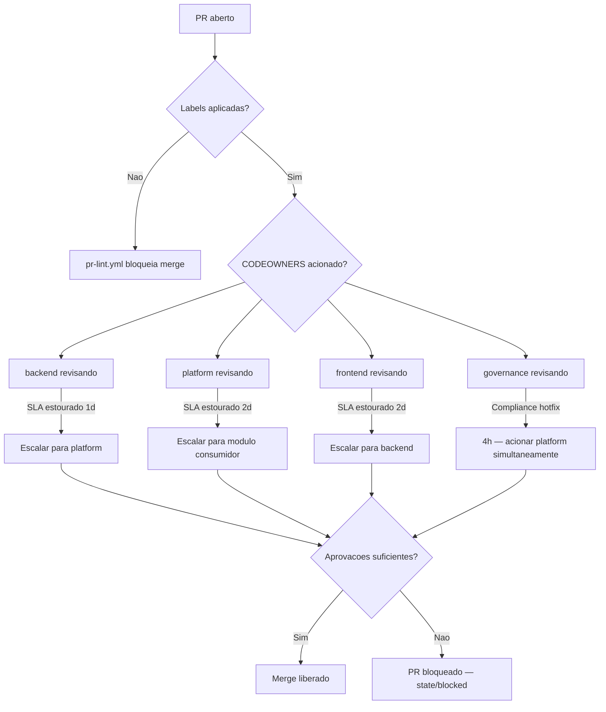

# Times e Responsabilidades Arquiteturais

> **Fonte de verdade para ownership**: `.github/CODEOWNERS`  
> **Governanca de PR**: `README.md` — secao "Governanca de PR"  
> **Ultima atualizacao**: 2026-03-26

Este documento detalha os quatro times de ownership do projeto `meu-chat-local`, seus escopos, criterios de escalonamento e como interagem no ciclo de revisao de PRs.

---

## Indice de times

| Handle GitHub | Nome operacional | SLA de primeira resposta (padrao) |
|---------------|------------------|-----------------------------------|
| `@meu-chat-local/backend` | Time Backend | 1 dia util |
| `@meu-chat-local/platform` | Time Plataforma | 2 dias uteis |
| `@meu-chat-local/frontend` | Time Frontend | 2 dias uteis |
| `@meu-chat-local/governance` | Time Governanca | 4 horas uteis (compliance) / 3 dias uteis (docs) |

---

## @meu-chat-local/backend

### Responsabilidades

- Logica de negocio em `modules/*/domain` e `modules/*/application`
- Contratos de rota HTTP definidos em `modules/*/application/register-*-routes.js`
- Contratos transversais em `shared/kernel` (HttpError, model-recovery) e `shared/config`
- Composicao de dependencias e wiring em `apps/api/src/bootstrap`
- Testes de integracao e unidade por modulo em `apps/api/tests`

### Escopo no CODEOWNERS

```
modules/*                   → backend (R/A)
shared/*                    → backend (R) + platform (A)
apps/api/src/bootstrap/*    → backend (R) + platform (A)
apps/api/src/http/*         → backend (R/A)
README.md, docs/            → backend + governance
```

### Criterios de escalonamento

| Situacao | Acao |
|----------|------|
| PR de rota HTTP sem revisao em 1 dia util | Mencionar `@meu-chat-local/platform` no PR |
| Mudanca em `shared/kernel` sem resposta em 1 dia util | Escalar para `@meu-chat-local/platform` (impacto transversal) |
| Dependencia ciclica detectada no bootstrap | Acionar `@meu-chat-local/platform` imediatamente |

### Checklist de revisao padrao (backend)

- [ ] ADR do modulo referenciado ou atualizado
- [ ] Contrato HTTP compativel com versao anterior (ou breaking-change documentado)
- [ ] Teste de sucesso e de erro cobertos
- [ ] Sem imports diretos de `platform/*` fora do bootstrap (violacao de camada)

---

## @meu-chat-local/platform

### Responsabilidades

- Adaptadores de infraestrutura em `platform/*` (SQLite, queue, Ollama, fs, observabilidade, telemetria)
- Migrations de banco em `platform/persistence/migrations`
- Orchestracao de lifecycle em `platform/orchestration`
- Runtime do container: `apps/api/Dockerfile`, `ops/docker/docker-compose.yml`
- Workflows de CI/CD em `ops/github/workflows` e `.github/workflows`
- Sincronizacao de labels: `.github/labels.yml` + `.github/workflows/sync-labels.yml`

### Escopo no CODEOWNERS

```
platform/*                  → platform (R/A)
ops/*                       → platform (R/A)
apps/api/Dockerfile         → platform + backend
.github/workflows/*         → platform + governance
```

### Criterios de escalonamento

| Situacao | Acao |
|----------|------|
| Mudanca em `platform/persistence` sem revisao em 2 dias uteis | Acionar owner do modulo consumidor + backend |
| Falha de migration em ambiente local | Platform assume investigacao; backend atua como consultor |
| Degradacao de LLM (Ollama timeout) | Platform verifica `platform/llm`; backend verifica model-recovery em `shared/kernel` |

### Checklist de revisao padrao (platform)

- [ ] Migration e reversivel (down migration implementada)
- [ ] Mudanca nao quebra portabilidade local-first (sem dependencia de cloud)
- [ ] Rollback de runtime documentado no PR
- [ ] Variaveis de ambiente novas adicionadas em `shared/config/env`

---

## @meu-chat-local/frontend

### Responsabilidades

- SPA principal em `apps/web/src` (app, infra, ui)
- Painel administrativo em `apps/web-admin/src`
- Consumo de endpoints da API (fetch, estado, tratamento de erro)
- Controles de RBAC e estado do cliente no frontend
- Testes de interface em `apps/web/tests`

### Escopo no CODEOWNERS

```
apps/web/*                  → frontend (R/A)
apps/web-admin/*            → frontend (R/A) + backend (C)
```

### Criterios de escalonamento

| Situacao | Acao |
|----------|------|
| PR de frontend que altera contrato de consumo de API | Mencionar `@meu-chat-local/backend` obrigatoriamente |
| Mudanca em `apps/web-admin` sem revisao em 2 dias uteis | Acionar `@meu-chat-local/backend` (impacto administrativo) |
| Regressao de RBAC no cliente | Acionar `@meu-chat-local/governance` imediatamente |

### Checklist de revisao padrao (frontend)

- [ ] Endpoints consumidos existem e estao documentados no ADR correspondente
- [ ] Erros HTTP tratados com feedback visual adequado (nao expor trace stack ao usuario)
- [ ] Nenhuma credencial ou token exposta no bundle do frontend
- [ ] RBAC do cliente alinhado com controle de acesso da API

---

## @meu-chat-local/governance

### Responsabilidades

- Compliance e auditoria: `modules/approvals`, `modules/audit`, `modules/users`
- Controle de acesso e RBAC: revisao de todas as mudancas que afetam permissoes
- Governanca do repositorio: `.github/CODEOWNERS`, `.github/labels.yml`, `README.md` (ADRs e gaps)
- Rastreamento de gaps de compliance da tabela no README
- Aprovacao de mudancas classificadas como `risk/high` ou `governance/compliance-gap`

### Escopo no CODEOWNERS

```
modules/approvals/*         → backend + governance (A)
modules/audit/*             → backend + governance (A)
modules/users/*             → backend + governance (A)
shared/security/*           → backend + governance (A)
.github/*                   → governance (A) + platform
README.md, docs/            → backend + governance
CHANGELOG.md                → governance (A)
```

### Criterios de escalonamento

| Situacao | Acao |
|----------|------|
| Hotfix de seguranca/compliance | Governance assume revisao em ate 4 horas uteis; acionar simultaneamente com platform |
| PR sem label `governance/compliance-gap` mas afetando RBAC | Governance solicita correcao antes de continuar revisao |
| Gap de compliance aberto ha mais de 2 sprints | Governance abre issue de escalonamento e atualiza severidade no README |

### Checklist de revisao padrao (governance)

- [ ] Gap de compliance afetado esta atualizado na tabela do README (severidade e status)
- [ ] Label `governance/compliance-gap` ou `governance/adr-update` presente quando aplicavel
- [ ] Mudancas de RBAC revisadas contra o modelo de permissoes atual
- [ ] Auditoria de evento registrada para acoes sensiveis (aprovacao, rejeicao, acesso privilegiado)

---

## Fluxo de escalonamento entre times



---

## Referencias cruzadas

| Documento | Conteudo relacionado |
|-----------|----------------------|
| `.github/CODEOWNERS` | Regras de reviewer obrigatorio por caminho de arquivo |
| `.github/labels.yml` | Definicao canonica das labels de area, risco, SLA e governanca |
| `.github/PULL_REQUEST_TEMPLATE.md` | Template de PR com secoes obrigatorias |
| `.github/workflows/pr-lint.yml` | Validacao automatica de labels, secoes e rollback |
| `README.md` — Matriz RACI | Papeis R/A/C/I por camada |
| `README.md` — SLA de revisao | Janelas de revisao e criterios de escalonamento |
| `README.md` — Gaps de compliance | Tabela de gaps com severidade e status atual |
