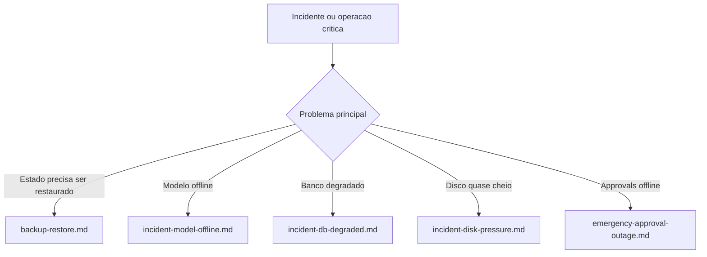

# Indice de Runbooks — meu-chat-local

Este diretorio concentra runbooks operacionais concretos derivados do template em [docs/architecture/runbook-template.md](../architecture/runbook-template.md).

Use este indice para decidir rapidamente qual procedimento abrir durante um incidente ou operacao de manutencao sensivel.

---

## Runbooks disponiveis

| Runbook | Quando usar | Dependencias criticas | `dry-run` util? | Bloqueia sem approval? | Observacoes |
|---------|-------------|-----------------------|-----------------|------------------------|-------------|
| [backup-restore.md](backup-restore.md) | Restaurar estado persistido a partir de backup validado | `backup`, `approvals`, `integrity`, `disaster-recovery` | Nao para o restore em si | Sim | Restore exige approval; pre-checks existem, mas a acao principal nao possui `dry-run` nativo |
| [incident-model-offline.md](incident-model-offline.md) | Modelo principal ou Ollama offline/degradado | `incident`, `health`, `chat`, `approvals` | Sim | Parcialmente | Usa `health.checks.model`, smoke test de chat e pode depender de fallback/retry |
| [incident-db-degraded.md](incident-db-degraded.md) | Banco SQLite degradado, mas API ainda responde | `incident`, `health`, `approvals` | Sim | Parcialmente | `dry-run` disponivel; `execute` e `rollback` exigem approval |
| [emergency-approval-outage.md](emergency-approval-outage.md) | `approvals` offline durante operacao critica | `governance`, `platform`, `backend` | Sim | Nao | Nao ha bypass tecnico implementado; documento de excecao manual temporaria |
| [incident-disk-pressure.md](incident-disk-pressure.md) | Espaco em disco baixo, crescimento anormal de artefatos ou risco de indisponibilidade | `health`, `storage`, `incident`, `approvals` | Sim | Parcialmente | `storage.cleanup` em `execute` exige approval; cleanup deve preservar backups validados |

---

## Fluxo de escolha rapida



## Matriz operacional resumida

| Cenario | Sinal primario | Endpoint/acao critica | Approval exigido | `dry-run` util? | Sem approval fica bloqueado? | Evidencias minimas |
|---------|----------------|-----------------------|------------------|-----------------|------------------------------|--------------------|
| `backup-restore` | Falha de integridade ou necessidade de rollback de estado | `POST /api/backup/restore` | Sim, `backup.restore` | Nao | Sim | `backup.validate`, JSON do restore, `integrity.verify`, teste de DR |
| `model-offline` | `checks.model` degradado ou Ollama offline | `incident.runbook.execute` + smoke test de chat | Sim, `incident.runbook.execute` | Sim | `execute` e `rollback` sim | `health`, `api/tags`, artefato do runbook, teste de `/api/chat` |
| `db-degraded` | `checks.db` degradado, erros de persistencia | `incident.runbook.execute` | Sim, `incident.runbook.execute` | Sim | `execute` e `rollback` sim | `health`, `slo`, `incident/status`, artefato do runbook |
| `disk-pressure` | alerta de disco e `usagePercent` alto | `storage.cleanup execute` | Sim, `storage.cleanup.execute` | Sim | Cleanup real sim | `health`, `storage/usage`, plano dry-run, resultado execute |
| `approval-outage` | falha no proprio fluxo de approval | Decisao manual tripla | Nao existe bypass tecnico | Sim | Nao, mas sem bypass nao libera acao destrutiva | tentativa falha de approval, simulacoes permitidas, registro formal de excecao |

---

## Plano tecnico acionavel — Gap #9

Objetivo: implementar um bypass emergencial **auditado**, limitado e reversivel para operacoes bloqueadas por `requireOperationalApproval` quando o proprio modulo de approvals estiver indisponivel.

### Escopo minimo da implementacao

| Item | Arquivos candidatos | Resultado esperado |
|------|---------------------|--------------------|
| Feature flag global | `shared/config/app-constants.js`, `shared/config/env/*` | Nova flag `EMERGENCY_BYPASS` com default seguro (`false`) |
| Guard central de approval | wiring/guard onde `requireOperationalApproval` e injetado | Guard passa a reconhecer bypass emergencial sob condicoes explicitas |
| Auditoria obrigatoria | modulo/servico de `recordAudit` e call sites bloqueados | Todo bypass gera evento auditavel dedicado |
| Metadados de excecao | payload das rotas criticas | Exigir `reason`, `ticketId` e `actorUserId` para bypass |
| Observabilidade | health/observability ou scorecard | Expor que o sistema entrou em modo emergencial |

### Operacoes que devem suportar bypass auditado

| Acao | Endpoint atual | Regra do bypass |
|------|----------------|-----------------|
| `backup.restore` | `POST /api/backup/restore` | Permitido somente com flag ativa + evidencias formais |
| `incident.runbook.execute` | `POST /api/incident/runbook/execute` em `execute`/`rollback` | Permitido somente quando approvals estiver comprovadamente indisponivel |
| `disaster-recovery.test` | `POST /api/disaster-recovery/test` | Permitido apenas em janela operacional controlada |
| `storage.cleanup.execute` | `POST /api/storage/cleanup` com `mode=execute` | Permitido com escopo minimo e preservacao de backups validados |

### Regras de seguranca do bypass

1. `EMERGENCY_BYPASS` deve nascer desabilitado e nunca ser ativado por default.
2. O bypass deve exigir campos obrigatorios no request: motivo, ticket de incidente e ator executor.
3. O evento de auditoria deve ser distinto do approval normal, por exemplo `operational.approval.bypass.used`.
4. O bypass deve ser visivel em health/scorecard enquanto estiver ativo.
5. O mecanismo deve ser simples de desligar imediatamente apos o incidente.

### Criterios de aceite

| Criterio | Passa quando |
|----------|--------------|
| Safe by default | Com flag ausente ou `false`, o comportamento atual nao muda |
| Auditavel | Todo bypass registra evento estruturado com `action`, `actorUserId`, `reason`, `ticketId` e timestamp |
| Limitado | Apenas as 4 acoes mapeadas podem usar bypass |
| Observavel | Health ou scorecard indicam estado emergencial ativo |
| Testado | Ha teste cobrindo flag desativada, flag ativada e ausencia de campos obrigatorios |

### Validacao recomendada apos implementacao

```bash
# 1. Garantir que sem flag o bloqueio continua
cd apps/api && npm test

# 2. Validar que approval normal continua funcionando
curl -s "$SERVER_URL/api/approvals?status=pending&page=1&limit=5" \
  -H "x-user-id: $ADMIN_USER_ID" | jq .

# 3. Validar health/scorecard com bypass ativo
curl -s "$SERVER_URL/api/health" | jq .
curl -s "$SERVER_URL/api/scorecard" -H "x-user-id: $ADMIN_USER_ID" | jq .
```

### Definicao de pronto para abrir implementacao

- [ ] owners de `governance`, `platform` e `backend` concordam com as quatro acoes cobertas
- [ ] evento de auditoria do bypass foi nomeado e teve payload definido
- [ ] runbook [emergency-approval-outage.md](emergency-approval-outage.md) foi alinhado ao fluxo futuro
- [ ] checklist de testes inclui cenarios com flag desligada e ligada

---

## Regras de uso

1. Sempre executar o caminho de simulacao (`dry-run`) quando o codigo permitir.
2. Toda operacao destrutiva deve ter evidencias anexadas ao incidente, PR operacional ou issue.
3. Se o runbook exigir approval e `approvals` estiver offline, migrar imediatamente para [emergency-approval-outage.md](emergency-approval-outage.md).
4. Ao fim do incidente, atualizar o runbook usado com licoes aprendidas se o procedimento real divergir do documento.

---

## Referencias

| Documento | Finalidade |
|-----------|------------|
| [docs/architecture/runbook-template.md](../architecture/runbook-template.md) | Estrutura padrao de novos runbooks |
| [docs/architecture/adr-index.md](../architecture/adr-index.md) | Contexto arquitetural e riscos residuais por modulo |
| [docs/architecture/teams.md](../architecture/teams.md) | Owners, escalonamento e checklists por time |
| [README.md](../../README.md) | Governanca geral, gaps de compliance e automacao de PR |